```matlab
1 = [];
2 = [];
3 = [];
4 = [];
5 = [];
6 = [];
7 = [];
8 = [];
9 = [];
10= [];
11= [];
12= [];
13= [];
14= [];
15= [];
16= [];
```

# 头部

* 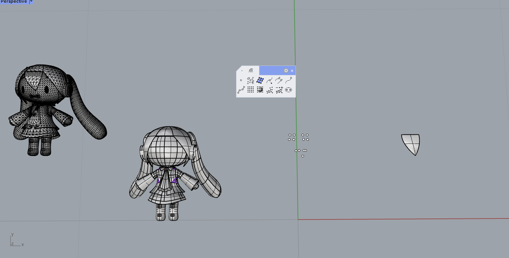

```matlab
1 = [0.163134,2.86943,0.851007];
2 = [0.163134,2.86943,0.851007];
3 = [0.163134,2.86943,0.851007];
4 = [0.163134,2.86943,0.851007];
5 = [-0.132369,3.10981,0.876723];
6 = [-0.00630125,3.11526,0.927799];
7 = [0.209835,3.11345,0.927485];
8 = [0.294057,3.11383,0.894287];
9 = [-0.421919,3.60741,0.856838];
10= [-0.226222,3.60625,0.920154];
11= [0.209325,3.60669,0.915636];
12= [0.400957,3.60644,0.835345];
13= [-0.387513,3.81609,0.779347];
14= [-0.195505,3.81532,0.803485];
15= [0.188419,3.81528,0.802642];
16= [0.387513,3.81609,0.779347];
```

* 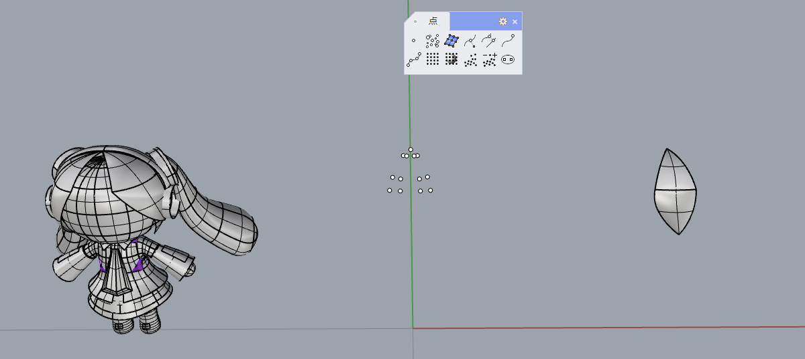

```matlab
1 = [-0.387513,3.81609,0.779347];
2 = [-0.185911,3.8153,0.804076];
3 = [0.192591,3.81529,0.802248];
4 = [0.387513,3.81609,0.779347];
5 = [-0.330671,4.02532,0.637661];
6 = [-0.17858,4.02547,0.709973];
7 = [0.175635,4.02548,0.710924];
8 = [0.332628,4.02534,0.637642];
9 = [-0.133881,4.29765,0.254704];
10= [-0.0712524,4.29767,0.268527];
11= [0.070588,4.29761,0.268587];
12= [0.132981,4.29757,0.254834];
13= [0,4.31274,0.008834];
14= [0,4.31274,0.008834];
15= [0,4.31274,0.008834];
16= [0,4.31274,0.008834];
```

* 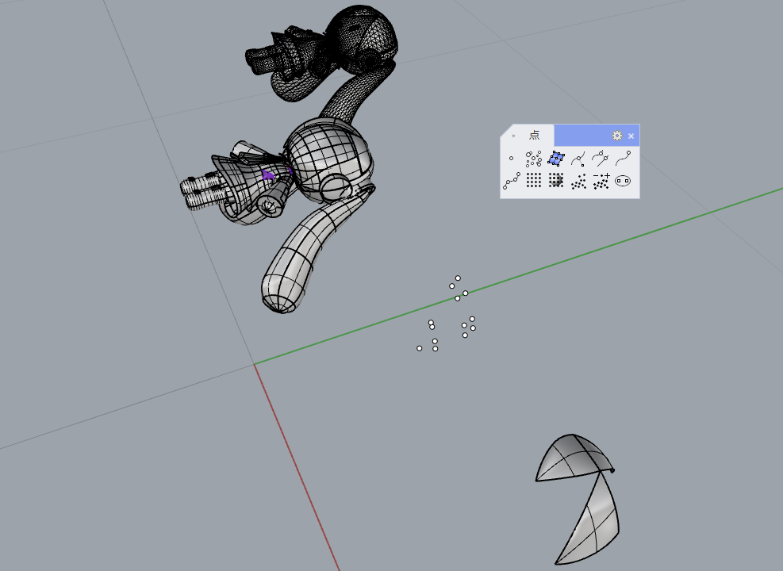

```matlab
1 = [0.387513,3.81609,0.779347];
2 = [0.706427,3.81539,0.660593];
3 = [0.963842,3.81552,0.234558];
4 = [0.975137,3.81549,0.009291];
5 = [0.602499,3.60075,0.832077];
6 = [0.837809,3.60089,0.722596];
7 = [1.07778,3.60075,0.259304];
8 = [1.08302,3.60078,0.0121213];
9 = [1.01403,2.9955,0.52957];
10= [1.05165,2.99563,0.458356];
11= [1.11817,2.9962,0.15775];
12= [1.11929,2.99611,-0.0268355];
13= [0.977643,2.7469,-0.020684];
14= [0.977643,2.7469,-0.020684];
15= [0.977643,2.7469,-0.020684];
16= [0.977643,2.7469,-0.020684];
```

* 

```matlab
1 = [0,4.31274,0.008834];
2 = [0,4.31274,0.008834];
3 = [0,4.31274,0.008834];
4 = [0,4.31274,0.008834];
5 = [0.128667,4.30012,0.247054];
6 = [0.208352,4.30031,0.224456];
7 = [0.334796,4.30061,0.0774238];
8 = [0.337626,4.3006,0.00900833];
9 = [0.32585,4.03867,0.623643];
10= [0.546076,4.03877,0.579086];
11= [0.851257,4.03867,0.24631];
12= [0.886923,4.03868,0.00805499];
13= [0.387513,3.81609,0.779347];
14= [0.69255,3.8154,0.675017];
15= [0.961723,3.81552,0.242628];
16= [0.975137,3.81549,0.009291];
```

* 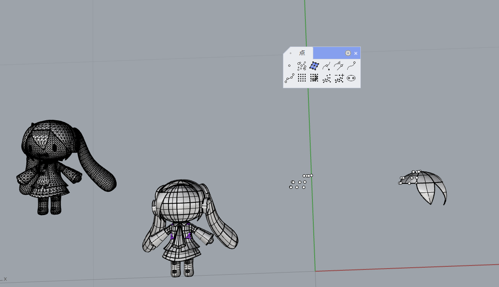

```matlab
1 = [0,4.31274,0.008834];
2 = [0,4.31274,0.008834];
3 = [0,4.31274,0.008834];
4 = [0,4.31274,0.008834];
5 = [-0.337526,4.30063,0.00900847];
6 = [-0.334655,4.30064,0.0775351];
7 = [-0.208324,4.30035,0.224183];
8 = [-0.12959,4.30023,0.246855];
9 = [-0.8869,4.0387,0.00805497];
10= [-0.85073,4.03869,0.246757];
11= [-0.547377,4.03879,0.578283];
12= [-0.323915,4.03868,0.623637];
13= [-0.975137,3.81549,0.009291];
14= [-0.962657,3.81552,0.242888];
15= [-0.68921,3.8154,0.674953];
16= [-0.387513,3.81609,0.779347];
```

* 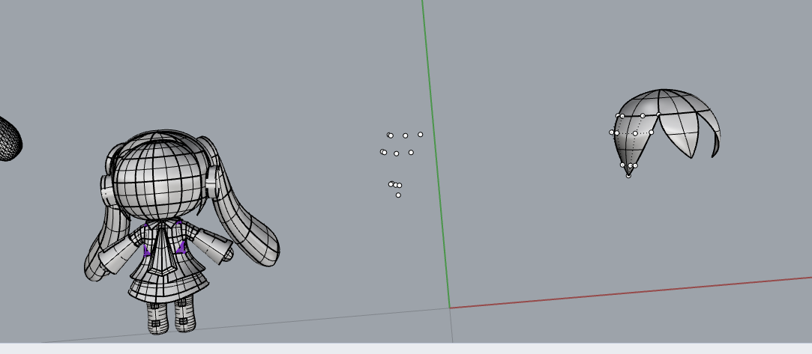

```matlab
1 = [-0.898412,2.51422,0.072156];
2 = [-0.898412,2.51422,0.072156];
3 = [-0.898412,2.51422,0.072156];
4 = [-0.898412,2.51422,0.072156];
5 = [-1.0199,2.77374,0.10413];
6 = [-1.0493,2.77397,0.190705];
7 = [-0.96275,2.77242,0.424639];
8 = [-0.886906,2.7719,0.496161];
9 = [-1.15302,3.46872,0.00464167];
10= [-1.13134,3.46864,0.290123];
11= [-0.918267,3.46922,0.776344];
12= [-0.618697,3.46934,0.875308];
13= [-0.975137,3.81549,0.009291];
14= [-0.963712,3.81552,0.240959];
15= [-0.687456,3.8154,0.67713];
16= [-0.387513,3.81609,0.779347];
```

* 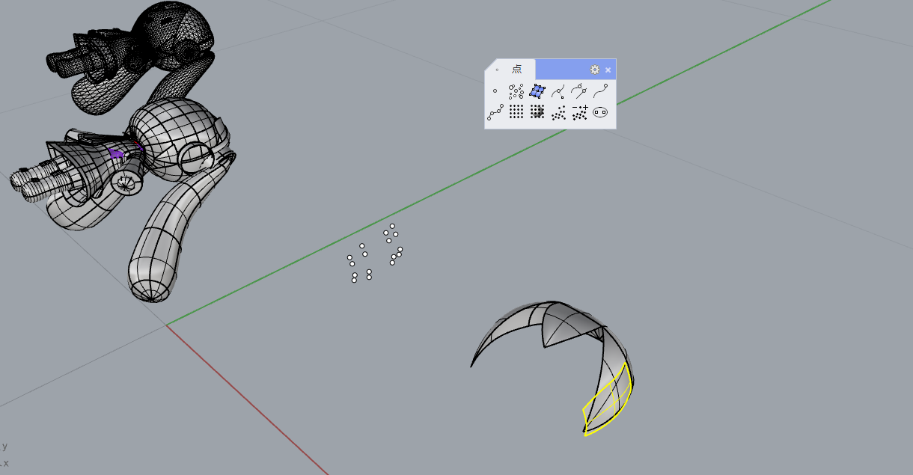

```matlab
1 = [0.825536,3.80516,0.402804];
2 = [0.899957,3.80714,0.265241];
3 = [0.981551,3.80995,-0.00983209];
4 = [0.936745,3.80987,-0.146858];
5 = [0.930764,3.57908,0.413714];
6 = [0.984789,3.58156,0.2773];
7 = [1.09227,3.58009,-0.00376147];
8 = [1.0374,3.57984,-0.154784];
9 = [0.923863,3.06823,0.389583];
10= [0.98436,3.0697,0.255102];
11= [1.04191,3.07396,-0.077499];
12= [1.02347,3.07406,-0.204115];
13= [0.892085,2.82706,0.262527];
14= [0.942784,2.82853,0.155462];
15= [0.978695,2.83184,-0.0527745];
16= [0.956336,2.81637,-0.169251];
```

* 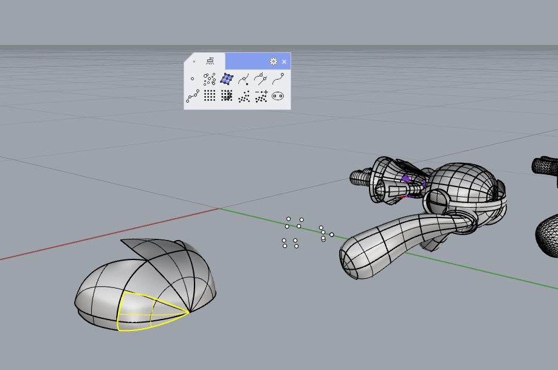

```matlab
1 = [0,3.29614,0.002957];
2 = [0,3.29614,0.002957];
3 = [0,3.29614,0.002957];
4 = [0,3.29614,0.002957];
5 = [0.291307,3.29877,-0.0460766];
6 = [0.30861,3.30325,-0.00355986];
7 = [0.286985,3.28479,0.108831];
8 = [0.318555,3.2543,0.209489];
9 = [0.842254,3.03553,-0.125002];
10= [0.875826,3.02865,-0.000827145];
11= [0.749686,3.01564,0.275518];
12= [0.670829,3.0173,0.392169];
13= [0.936745,2.80987,-0.146858];
14= [1.00791,2.84328,-0.00995678];
15= [0.863938,2.79462,0.249093];
16= [0.825536,2.80516,0.402804];
```

* 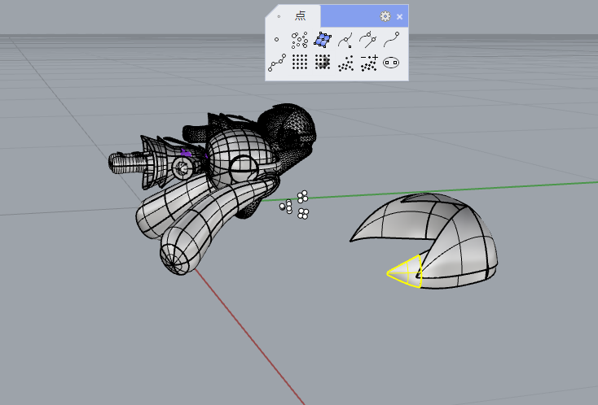

```matlab
1 = [0.724472,2.43958,0.013409];
2 = [0.725894,2.43951,0.00242714];
3 = [0.725948,2.43937,-0.00712256];
4 = [0.72009,2.44127,-0.023295];
5 = [0.798123,2.5404,0.095462];
6 = [0.818344,2.54203,0.0590951];
7 = [0.831249,2.54216,-0.0243024];
8 = [0.815473,2.54767,-0.0799925];
9 = [0.87615,2.74437,0.219798];
10= [0.914161,2.74583,0.128644];
11= [0.952026,2.74767,-0.0617604];
12= [0.926769,2.73652,-0.1559];
13= [0.892085,2.82706,0.262527];
14= [0.941541,2.82869,0.163319];
15= [0.97966,2.83117,-0.0711042];
16= [0.956336,2.81637,-0.169251];
```

* 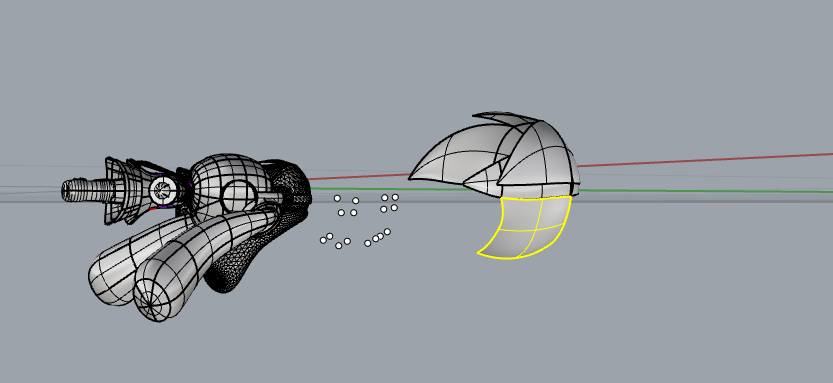

```matlab
1 = [0.956336,2.81637,-0.169251];
2 = [0.929496,2.89841,-0.392056];
3 = [0.647817,2.82274,-0.762659];
4 = [0.360145,2.83284,-0.837266];
5 = [1.0441,3.09036,-0.206116];
6 = [1.02901,3.06456,-0.39184];
7 = [0.757325,3.07792,-0.845511];
8 = [0.426796,3.07484,-0.927732];
9 = [1.05043,3.58232,-0.157975];
10= [1.00311,3.59003,-0.342831];
11= [0.715923,3.58721,-0.815463];
12= [0.411952,3.58778,-0.893778];
13= [0.949869,3.81637,-0.150115];
14= [0.910385,3.81631,-0.320362];
15= [0.654971,3.81671,-0.704673];
16= [0.379614,3.81668,-0.786723];
```

* 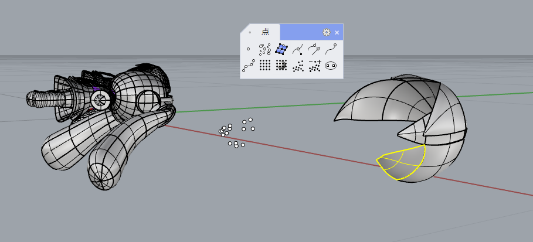

```matlab
1 = [0.187723,2.51033,-0.484627];
2 = [0.242633,2.51416,-0.465092];
3 = [0.359367,2.47083,-0.40478];
4 = [0.390539,2.47945,-0.380355];
5 = [0.22938,2.54874,-0.566677];
6 = [0.407615,2.53495,-0.508492];
7 = [0.513095,2.55287,-0.393226];
8 = [0.538664,2.53959,-0.325742];
9 = [0.323907,2.67365,-0.763607];
10= [0.542584,2.6944,-0.734796];
11= [0.823034,2.72459,-0.382473];
12= [0.86125,2.72118,-0.222595];
13= [0.360145,2.83284,-0.837266];
14= [0.639338,2.82248,-0.77273];
15= [0.934999,2.89732,-0.380357];
16= [0.956336,2.81637,-0.169251];
```

* 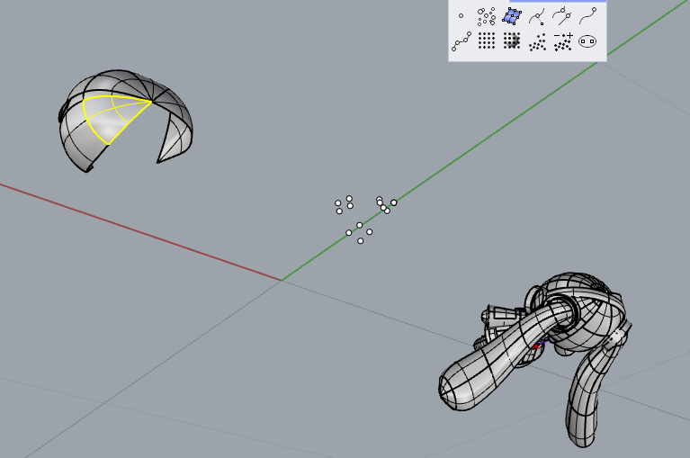

```matlab
1 = [0,4.31274,0.008834];
2 = [0,4.31274,0.008834];
3 = [0,4.31274,0.008834];
4 = [0,4.31274,0.008834];
5 = [0.330598,4.29996,-0.0533046];
6 = [0.315187,4.29992,-0.113878];
7 = [0.221368,4.29984,-0.19239];
8 = [0.12873,4.29981,-0.229741];
9 = [0.846871,4.04999,-0.126315];
10= [0.813795,4.04993,-0.272583];
11= [0.570001,4.05,-0.606011];
12= [0.331555,4.04991,-0.668364];
13= [0.949869,3.81637,-0.150115];
14= [0.908599,3.81631,-0.324821];
15= [0.649759,3.81672,-0.709294];
16= [0.379614,3.81668,-0.786723];
```

* 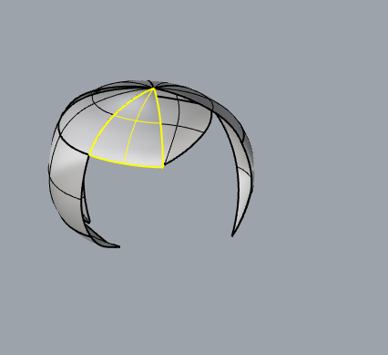

```matlab
1 = [0,4.31274,0.008834];
2 = [0,4.31274,0.008834];
3 = [0,4.31274,0.008834];
4 = [0,4.31274,0.008834];
5 = [0.135852,4.29457,-0.24438];
6 = [0.0694505,4.29455,-0.26554];
7 = [-0.0694505,4.29455,-0.26554];
8 = [-0.135852,4.29457,-0.24438];
9 = [0.33494,4.04216,-0.676105];
10= [0.171282,4.04211,-0.725391];
11= [-0.171282,4.04211,-0.725391];
12= [-0.33494,4.04216,-0.676105];
13= [0.379614,3.81668,-0.786723];
14= [0.195344,3.81667,-0.845004];
15= [-0.195344,3.81667,-0.845004];
16= [-0.379614,3.81668,-0.786723];
```

* 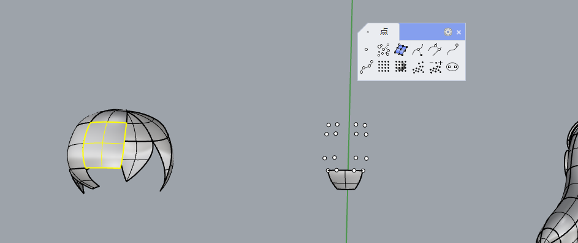

```matlab
1 = [0.379614,3.81668,-0.786723];
2 = [0.197068,3.81667,-0.844827];
3 = [-0.197068,3.81667,-0.844827];
4 = [-0.379614,3.81668,-0.786723];
5 = [0.412036,3.58792,-0.893906];
6 = [0.212726,3.58772,-0.956768];
7 = [-0.212726,3.58772,-0.956768];
8 = [-0.412036,3.58792,-0.893906];
9 = [0.426577,3.07171,-0.927488];
10= [0.218216,3.07226,-0.990592];
11= [-0.218216,3.07226,-0.990592];
12= [-0.426577,3.07171,-0.927488];
13= [0.360145,2.83284,-0.837266];
14= [0.180917,2.82949,-0.886517];
15= [-0.180917,2.82949,-0.886517];
16= [-0.360145,2.83284,-0.837266];
```

* 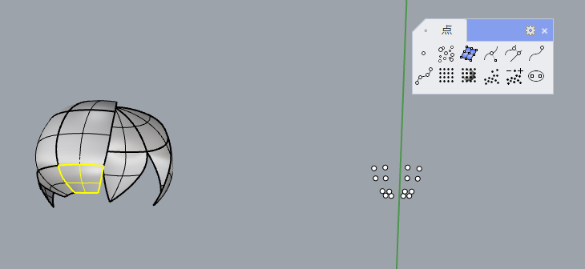

```matlab
1 = [0.360145,2.83284,-0.837266];
2 = [0.179791,2.82948,-0.88662];
3 = [-0.179791,2.82948,-0.88662];
4 = [-0.360145,2.83284,-0.837266];
5 = [0.332626,2.6895,-0.781778];
6 = [0.170276,2.67356,-0.816958];
7 = [-0.170276,2.67356,-0.816958];
8 = [-0.332626,2.6895,-0.781778];
9 = [0.233714,2.55294,-0.575598];
10= [0.123251,2.53597,-0.607924];
11= [-0.123251,2.53597,-0.607924];
12= [-0.233714,2.55294,-0.575598];
13= [0.187723,2.51033,-0.484627];
14= [0.0976397,2.49463,-0.517713];
15= [-0.0976397,2.49463,-0.517713];
16= [-0.187723,2.51033,-0.484627];
```

* 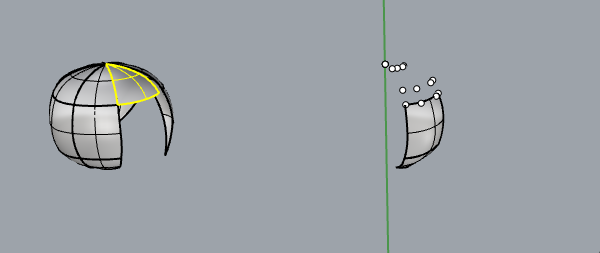

```matlab
1 = [0,4.31274,0.008834];
2 = [0,4.31274,0.008834];
3 = [0,4.31274,0.008834];
4 = [0,4.31274,0.008834];
5 = [-0.12873,4.29981,-0.229741];
6 = [-0.221368,4.29984,-0.19239];
7 = [-0.315187,4.29992,-0.113878];
8 = [-0.330598,4.29996,-0.0533046];
9 = [-0.331555,4.04991,-0.668364];
10= [-0.570001,4.05,-0.606011];
11= [-0.813795,4.04993,-0.272583];
12= [-0.846871,4.04999,-0.126315];
13= [-0.379614,3.81668,-0.786723];
14= [-0.649759,3.81672,-0.709294];
15= [-0.908599,3.81631,-0.324821];
16= [-0.949869,3.81637,-0.150115];
```

* 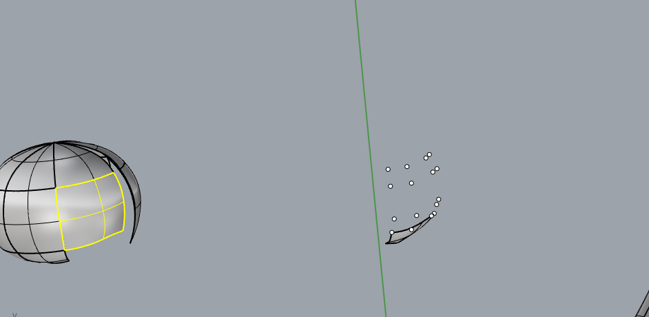

```matlab
1 = [-0.379614,3.81668,-0.786723];
2 = [-0.655162,3.81671,-0.703859];
3 = [-0.908483,3.81631,-0.32444];
4 = [-0.949869,3.81637,-0.150115];
5 = [-0.41181,3.58726,-0.893586];
6 = [-0.71591,3.587,-0.814608];
7 = [-1.00075,3.58889,-0.347101];
8 = [-1.05019,3.58393,-0.159117];
9 = [-0.427204,3.08059,-0.928182];
10= [-0.757978,3.0825,-0.844284];
11= [-1.02778,3.07274,-0.397871];
12= [-1.04504,3.08816,-0.201567];
13= [-0.360145,2.83284,-0.837266];
14= [-0.647815,2.82752,-0.764474];
15= [-0.92789,2.88695,-0.389987];
16= [-0.955549,2.84681,-0.186218];
```

* 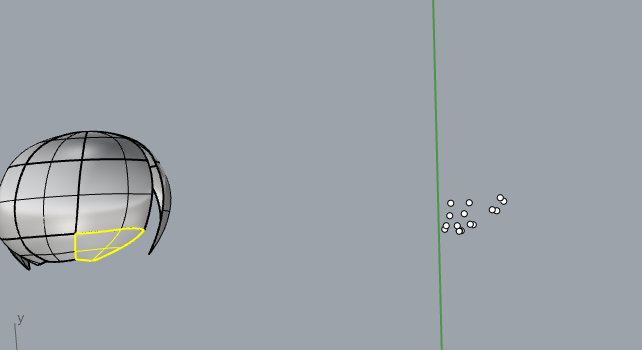

```matlab
1 = [-0.187723,2.51033,-0.484627];
2 = [-0.366422,2.47362,-0.400655];
3 = [-0.36678,2.47747,-0.398423];
4 = [-0.390539,2.47945,-0.380355];
5 = [-0.231604,2.55138,-0.571254];
6 = [-0.37282,2.54501,-0.535802];
7 = [-0.522379,2.55446,-0.394827];
8 = [-0.54303,2.54716,-0.317051];
9 = [-0.324276,2.67453,-0.764398];
10= [-0.520588,2.68856,-0.75879];
11= [-0.828448,2.72684,-0.382709];
12= [-0.858696,2.72031,-0.21394];
13= [-0.360145,2.83284,-0.837266];
14= [-0.603877,2.82281,-0.810411];
15= [-0.938186,2.88657,-0.371729];
16= [-0.955549,2.84681,-0.186218];
```

* 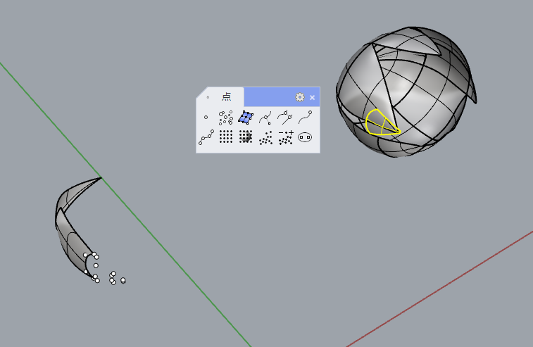

```matlab
1 = [-0.724472,2.43958,0.013409];
2 = [-0.72592,2.43951,0.0023157];
3 = [-0.725892,2.43938,-0.00734136];
4 = [-0.72009,2.44127,-0.023295];
5 = [-0.797262,2.53523,0.0928548];
6 = [-0.81968,2.54744,0.0606469];
7 = [-0.833052,2.54649,-0.0261187];
8 = [-0.813676,2.54579,-0.0810601];
9 = [-0.887049,2.77981,0.240103];
10= [-0.923203,2.75613,0.129023];
11= [-0.961383,2.7607,-0.0674286];
12= [-0.943668,2.76242,-0.161972];
13= [-0.892085,2.82706,0.262527];
14= [-0.968095,2.93146,0.204781];
15= [-1.01269,2.92311,-0.0849056];
16= [-0.955549,2.84681,-0.186218];
```

* 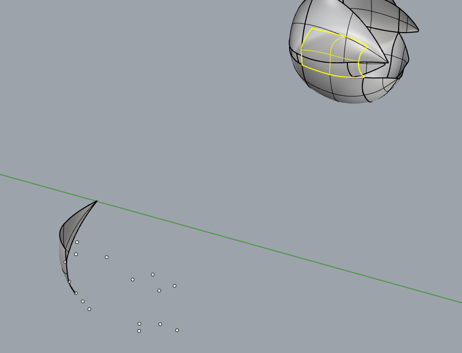

```matlab
1 = [-0.892085,2.82706,0.262527];
2 = [-0.926425,2.9791,0.355969];
3 = [-0.950599,3.36185,0.416126];
4 = [-0.894324,3.6849,0.415119];
5 = [-0.956448,2.92249,0.236464];
6 = [-0.993492,3.1189,0.312633];
7 = [-0.966598,3.64971,0.362876];
8 = [-0.932641,3.83748,0.184737];
9 = [-1.01639,2.92947,-0.0754612];
10= [-1.06237,3.09056,-0.0907079];
11= [-1.08423,3.59754,-0.02547];
12= [-0.975137,3.81549,0.009291];
13= [-0.947184,2.83821,-0.18358];
14= [-1.05292,3.12205,-0.201408];
15= [-1.04506,3.60143,-0.157046];
16= [-0.949869,3.81637,-0.150115];
```

* 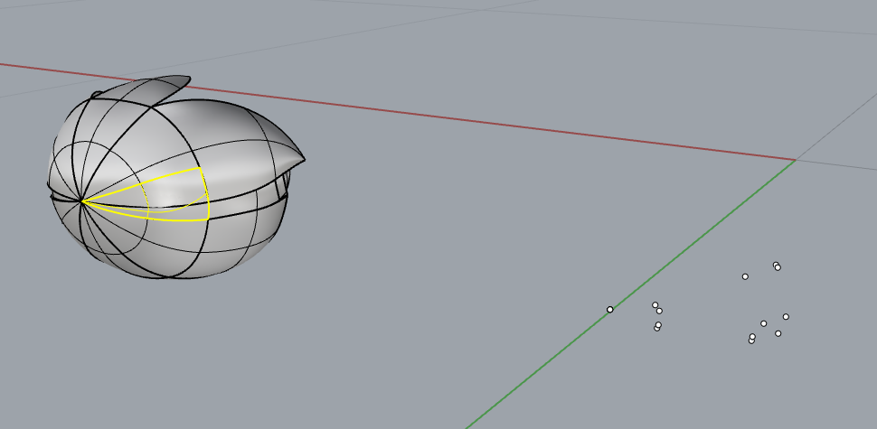

```matlab
1 = [0,4.31274,0.008834];
2 = [0,4.31274,0.008834];
3 = [0,4.31274,0.008834];
4 = [0,4.31274,0.008834];
5 = [-0.302716,4.30178,0.0980291];
6 = [-0.329422,4.29964,0.0609299];
7 = [-0.32756,4.30471,-0.0291971];
8 = [-0.319431,4.30392,-0.0515813];
9 = [-0.782934,4.04639,0.286162];
10= [-0.916495,4.04182,-0.000531932];
11= [-0.85065,4.05237,-0.0959556];
12= [-0.847273,4.05024,-0.126401];
13= [-0.907306,3.81549,0.306763];
14= [-0.918876,3.81562,0.292044];
15= [-0.991332,3.81532,-0.0262969];
16= [-0.949869,3.81637,-0.150115];
```

* 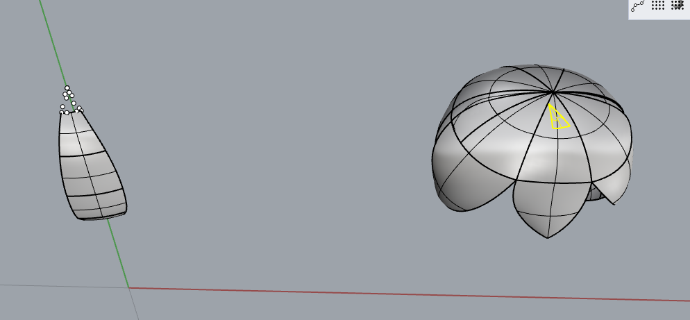

```matlab
1 = [-8.88178e-16,4.1344,0.003398];
2 = [-8.88178e-16,4.13698,0.0922632];
3 = [-1.77636e-15,4.10978,0.237968];
4 = [0,4.08888,0.301847];
5 = [-8.88178e-16,4.1344,0.003398];
6 = [0.0246965,4.13545,0.14308];
7 = [0.0516416,4.09109,0.301965];
8 = [0.0484263,4.08422,0.308533];
9 = [-8.88178e-16,4.1344,0.003398];
10= [0.0364786,4.13764,0.0645814];
11= [0.105337,4.11794,0.194805];
12= [0.146537,4.09092,0.278528];
13= [8.88178e-16,4.1344,0.003398];
14= [0.0709531,4.13611,0.106563];
15= [0.167513,4.0992,0.239532];
16= [0.188567,4.08625,0.265869];
```

* 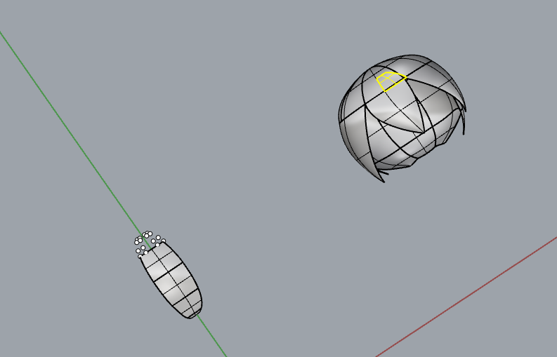

```matlab
1 = [0,4.08888,0.301847];
2 = [0.0506928,4.08423,0.30806];
3 = [0.141929,4.09082,0.279862];
4 = [0.188567,4.08625,0.265869];
5 = [-8.88178e-16,4.05124,0.402842];
6 = [0.0680513,4.04499,0.406845];
7 = [0.194495,4.05384,0.374634];
8 = [0.255735,4.0477,0.351491];
9 = [0,3.90728,0.577148];
10= [0.101571,3.90957,0.57578];
11= [0.300343,3.90633,0.536822];
12= [0.388278,3.90858,0.494822];
13= [0,3.80715,0.640251];
14= [0.115748,3.80715,0.640342];
15= [0.340006,3.80715,0.593899];
16= [0.440995,3.80715,0.547711];
```

* 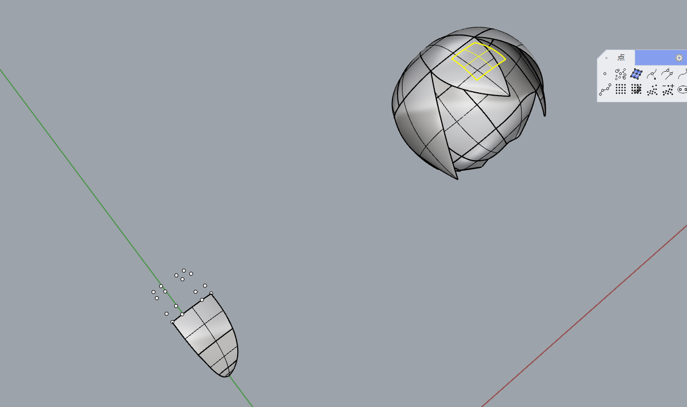

```matlab
1 = [0,3.80715,0.640251];
2 = [0.116288,3.80715,0.64024];
3 = [0.339209,3.80715,0.594106];
4 = [0.440995,3.80715,0.547711];
5 = [0,3.70228,0.708593];
6 = [0.130758,3.70228,0.708578];
7 = [0.381422,3.70228,0.656759];
8 = [0.495873,3.70228,0.604638];
9 = [8.88178e-16,3.45652,0.779386];
10= [0.145884,3.45652,0.779375];
11= [0.425547,3.45652,0.720801];
12= [0.553238,3.45652,0.66198];
13= [0,3.32612,0.783679];
14= [0.146871,3.32612,0.783671];
15= [0.428423,3.32612,0.724252];
16= [0.556979,3.32612,0.664638];
```

* 

```matlab
1 = [0,3.32612,0.783679];
2 = [0.146891,3.32612,0.783669];
3 = [0.42846,3.32612,0.724241];
4 = [0.556979,3.32612,0.664638];
5 = [8.88178e-16,3.19465,0.790711];
6 = [0.148426,3.19465,0.790702];
7 = [0.432935,3.19465,0.730404];
8 = [0.562798,3.19465,0.669957];
9 = [0,2.93545,0.763053];
10= [0.142388,2.93545,0.763039];
11= [0.415333,2.93545,0.706166];
12= [0.539912,2.93545,0.649036];
13= [0,2.81548,0.716154];
14= [0.132406,2.81548,0.716139];
15= [0.386212,2.81548,0.663496];
16= [0.502057,2.81548,0.610584];
```

* 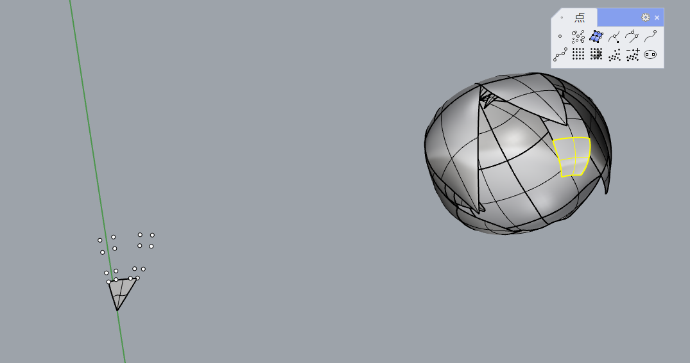

```matlab
1 = [0,2.81548,0.716154];
2 = [0.132081,2.81548,0.71621];
3 = [0.387014,2.81548,0.663282];
4 = [0.502057,2.81548,0.610584];
5 = [8.88178e-16,2.70861,0.654648];
6 = [0.123721,2.70893,0.66859];
7 = [0.362171,2.70838,0.625348];
8 = [0.470039,2.70836,0.574939];
9 = [0,2.53259,0.550857];
10= [0.0913414,2.53169,0.54683];
11= [0.268465,2.53377,0.508184];
12= [0.347833,2.53529,0.470257];
13= [0,2.48568,0.460243];
14= [0.0727598,2.48887,0.46185];
15= [0.209013,2.48582,0.430114];
16= [0.27401,2.49295,0.39981];
```

* 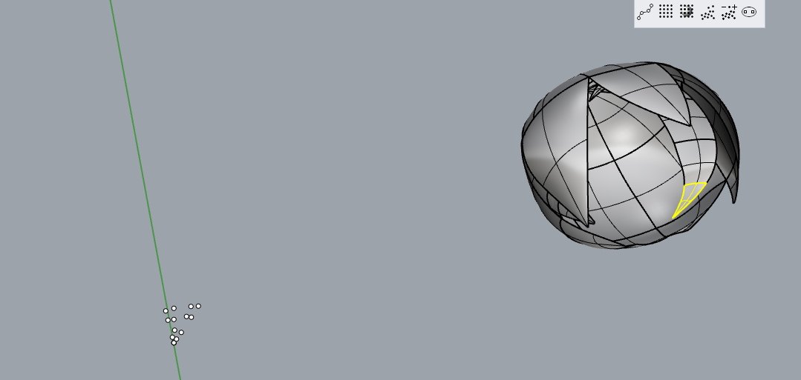

```matlab
1 = [-8.88178e-16,2.48568,0.460243];
2 = [-8.88178e-16,2.44168,0.376];
3 = [0,2.42416,0.107029];
4 = [-1.77636e-15,2.42652,0.006061];
5 = [0.0718959,2.48884,0.462068];
6 = [0.0497414,2.44523,0.356506];
7 = [0.0345274,2.42531,0.2131];
8 = [0,2.42652,0.006061];
9 = [0.211846,2.48586,0.429295];
10= [0.158618,2.44288,0.360946];
11= [0.0291609,2.42539,0.0554928];
12= [-8.88178e-16,2.42652,0.006061];
13= [0.27401,2.49295,0.39981];
14= [0.197394,2.45073,0.31847];
15= [0.0853661,2.42946,0.14572];
16= [0,2.42652,0.006061];
```

* 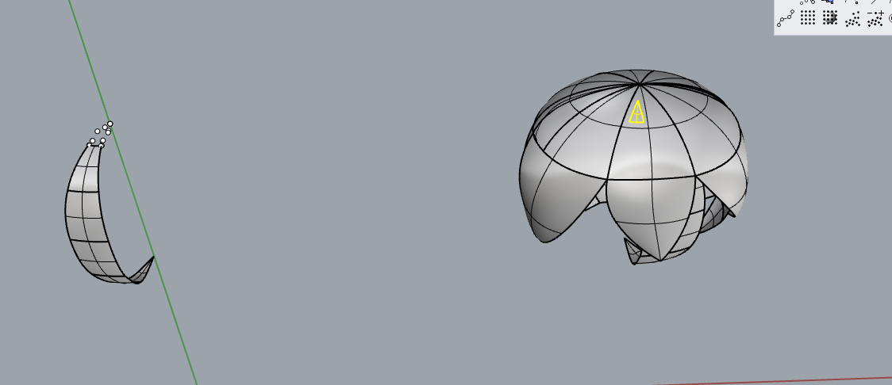

```matlab
1 = [-2.66454e-15,4.1344,0.003398];
2 = [-0.0835162,4.1359,0.129284];
3 = [-0.105629,4.10622,0.238606];
4 = [-0.127838,4.08888,0.284266];
5 = [-2.66454e-15,4.1344,0.003398];
6 = [-0.0296115,4.14054,0.0705953];
7 = [-0.101295,4.1063,0.243129];
8 = [-0.121472,4.08739,0.291056];
9 = [-4.44089e-15,4.1344,0.003398];
10= [-2.66454e-15,4.10961,0.0810234];
11= [-0.00462872,4.10489,0.256638];
12= [-0.00733622,4.08742,0.306641];
13= [-2.66454e-15,4.1344,0.003398];
14= [0.0234848,4.12855,0.146767];
15= [-1.77636e-15,4.11231,0.251883];
16= [-8.88178e-16,4.08888,0.301847];
```

* 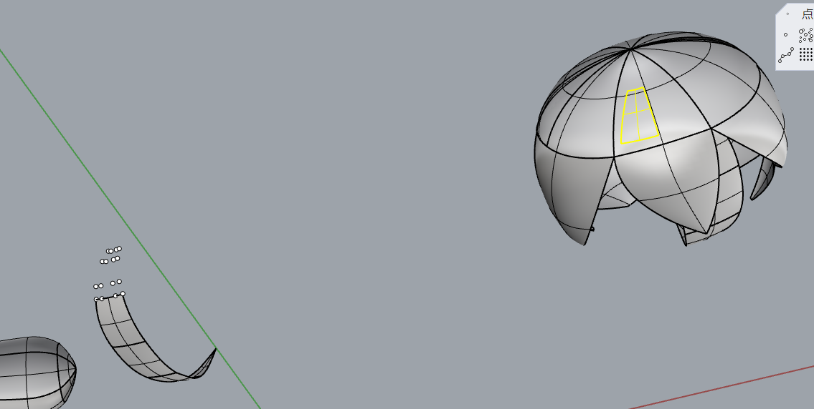

```matlab
1 = [-0.127838,4.08888,0.284266];
2 = [-0.0972377,4.08711,0.295513];
3 = [-0.0336113,4.08714,0.304145];
4 = [-8.88178e-16,4.08888,0.301847];
5 = [-0.174656,4.05113,0.378986];
6 = [-0.132722,4.04875,0.392572];
7 = [-0.0452036,4.04879,0.404476];
8 = [-8.88178e-16,4.05113,0.403004];
9 = [-0.268008,3.90737,0.540189];
10= [-0.203345,3.90824,0.558006];
11= [-0.0675882,3.90822,0.576525];
12= [0,3.90737,0.577049];
13= [-0.303791,3.80715,0.598473];
14= [-0.230564,3.80715,0.619329];
15= [-0.0769985,3.80715,0.640267];
16= [0,3.80715,0.640251];
```

* 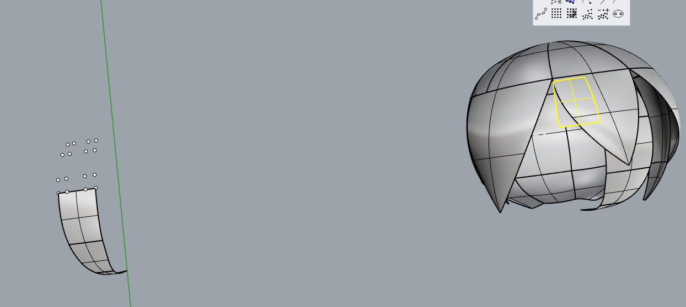

```matlab
1 = [-0.303791,3.80715,0.598473];
2 = [-0.230308,3.80715,0.619371];
3 = [-0.0775563,3.80715,0.640221];
4 = [0,3.80715,0.640251];
5 = [-0.341697,3.70182,0.66183];
6 = [-0.259043,3.70182,0.685315];
7 = [-0.0872353,3.70182,0.708739];
8 = [-1.77636e-15,3.70182,0.708774];
9 = [-0.381129,3.45632,0.726379];
10= [-0.28894,3.45632,0.752907];
11= [-0.28894,3.45632,0.752907];
12= [0,3.45632,0.779413];
13= [-0.38369,3.32612,0.729893];
14= [-0.290881,3.32612,0.756798];
15= [-0.097955,3.32612,0.78364];
16= [0,3.32612,0.783679];
```

* 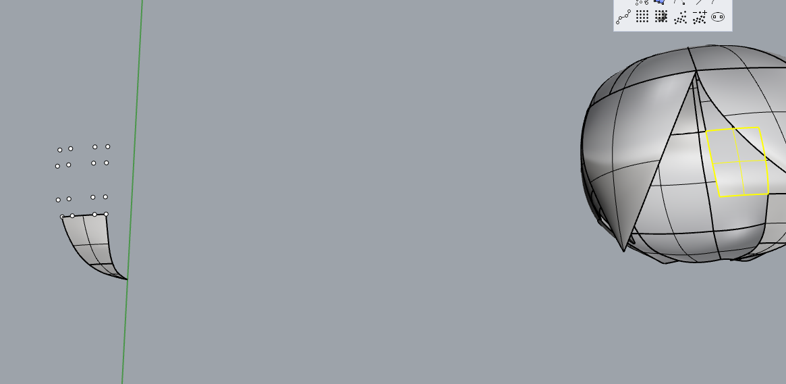

```matlab
1 = [-0.38369,3.32612,0.729893];
2 = [-0.290895,3.32612,0.756795];
3 = [-0.0979605,3.32612,0.78364];
4 = [0,3.32612,0.783679];
5 = [-0.387695,3.19467,0.736136];
6 = [-0.293931,3.19467,0.76343];
7 = [-0.0989836,3.19467,0.790665];
8 = [8.88178e-16,3.19467,0.790705];
9 = [-0.371959,2.9357,0.711605];
10= [-0.282002,2.9357,0.73736];
11= [-0.0949639,2.9357,0.763063];
12= [0,2.9357,0.763098];
13= [-0.345856,2.81548,0.668489];
14= [-0.26221,2.81548,0.692331];
15= [-0.0883013,2.81548,0.716119];
16= [0,2.81548,0.716154];
```

* 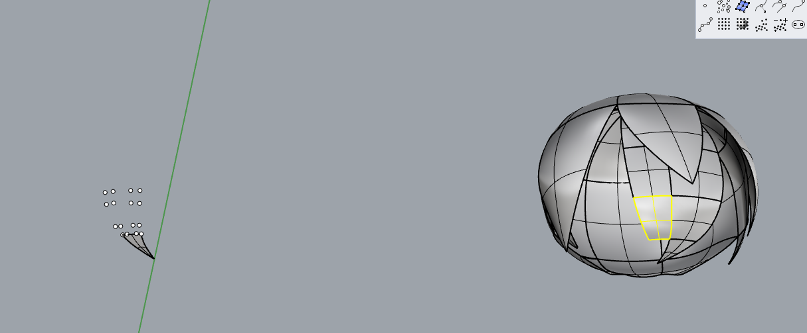

```matlab
1 = [-0.345856,2.81548,0.668489];
2 = [-0.262412,2.81548,0.692295];
3 = [-0.087989,2.81548,0.716146];
4 = [0,2.81548,0.716154];
5 = [-0.32439,2.71018,0.62974];
6 = [-0.246137,2.71039,0.655036];
7 = [-0.0825875,2.71042,0.658751];
8 = [8.88178e-16,2.71031,0.655637];
9 = [-0.239792,2.5334,0.512024];
10= [-0.181911,2.53243,0.527994];
11= [-0.0608573,2.53217,0.549865];
12= [0,2.53249,0.550806];
13= [-0.187422,2.4873,0.433386];
14= [-0.14233,2.48743,0.447658];
15= [-0.048397,2.4869,0.460807];
16= [0,2.48568,0.460243];
```

* 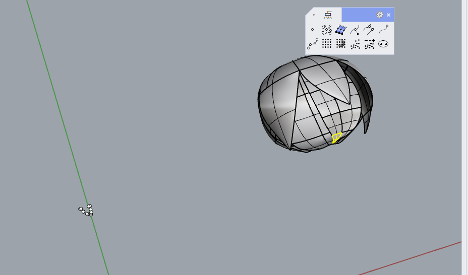

```matlab
1 = [-0.187422,2.4873,0.433386];
2 = [-0.138139,2.44408,0.354374];
3 = [-0.0765224,2.4268,0.170765];
4 = [1.77636e-15,2.42652,0.006061];
5 = [-0.165732,2.48754,0.443349];
6 = [-0.133107,2.4444,0.343528];
7 = [-0.036447,2.42586,0.100314];
8 = [-1.77636e-15,2.42653,0.006061];
9 = [-0.0238894,2.48662,0.463377];
10= [-0.000836371,2.44186,0.363603];
11= [1.77636e-15,2.42421,0.106859];
12= [1.77636e-15,2.42652,0.006061];
13= [0,2.48568,0.460243];
14= [-1.77636e-15,2.4415,0.374994];
15= [0.0117313,2.42484,0.185394];
16= [1.77636e-15,2.42652,0.006061];
```

* 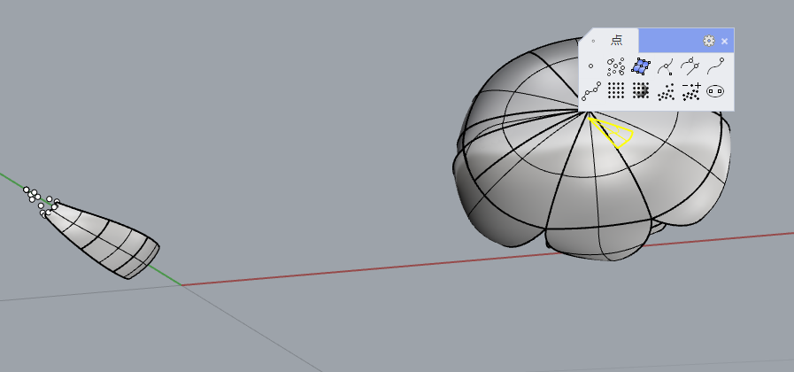

```matlab
1 = [0,4.1344,0.003398];
2 = [0.0718211,4.13587,0.107783];
3 = [0.167946,4.099,0.24011];
4 = [0.188567,4.08625,0.265869];
5 = [0,4.1344,0.003398];
6 = [0.051242,4.13755,0.0593311];
7 = [0.156096,4.11709,0.174028];
8 = [0.227098,4.09076,0.240066];
9 = [0,4.1344,0.003398];
10= [0.130059,4.13511,0.0912327];
11= [0.286794,4.09087,0.192771];
12= [0.297232,4.08422,0.194301];
13= [0,4.1344,0.003398];
14= [0.090925,4.13685,0.0429307];
15= [0.240009,4.10956,0.113989];
16= [0.308628,4.08888,0.145557];
```

* 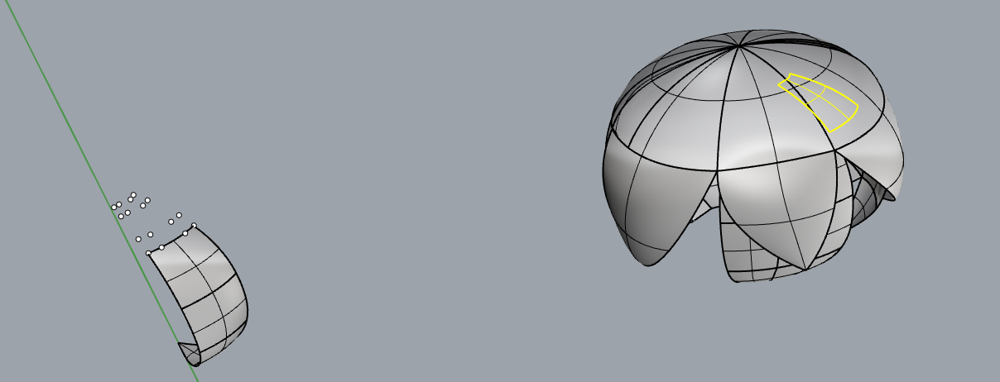

```matlab
1 = [0.188567,4.08625,0.265869];
2 = [0.222281,4.0909,0.243256];
3 = [0.297864,4.08427,0.193817];
4 = [0.308628,4.08888,0.145557];
5 = [0.255999,4.04737,0.351779];
6 = [0.305737,4.05362,0.324314];
7 = [0.402588,4.04471,0.253007];
8 = [0.421898,4.05091,0.19505];
9 = [0.386812,3.91038,0.493258];
10= [0.471803,3.90815,0.456534];
11= [0.603862,3.91133,0.34214];
12= [0.64468,3.90912,0.262781];
13= [0.440995,3.80715,0.547711];
14= [0.535748,3.80715,0.504821];
15= [0.689416,3.80715,0.375781];
16= [0.733417,3.80716,0.287159];
```

* 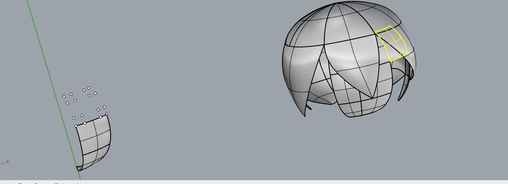

```matlab
1 = [0.440995,3.80715,0.547711];
2 = [0.534352,3.80716,0.505701];
3 = [0.687984,3.80715,0.377368];
4 = [0.733417,3.80715,0.287159];
5 = [0.494885,3.70536,0.603634];
6 = [0.599652,3.70536,0.556554];
7 = [0.772057,3.70536,0.412468];
8 = [0.823041,3.70536,0.312966];
9 = [0.55305,3.45811,0.661801];
10= [0.67013,3.45811,0.60855];
11= [0.862801,3.45811,0.447755];
12= [0.919778,3.45811,0.338922];
13= [0.556979,3.32612,0.664638];
14= [0.67489,3.32612,0.610619];
15= [0.67489,3.32612,0.610619];
16= [0.92631,3.32612,0.339729];
```

* 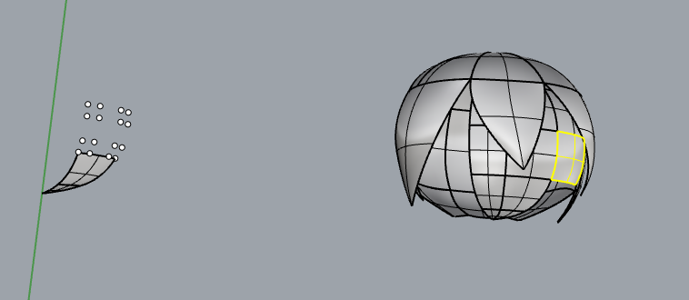

```matlab
1 = [0.556979,3.32612,0.664638];
2 = [0.67481,3.32612,0.610649];
3 = [0.868597,3.32612,0.449191];
4 = [0.92631,3.32612,0.339729];
5 = [0.562828,3.1944,0.669991];
6 = [0.681897,3.1944,0.615222];
7 = [0.877718,3.1944,0.452153];
8 = [0.936037,3.1944,0.341909];
9 = [0.539636,2.93363,0.648768];
10= [0.653798,2.93363,0.597091];
11= [0.841551,2.93363,0.440408];
12= [0.897468,2.93363,0.333266];
13= [0.502057,2.81548,0.610584];
14= [0.60827,2.81548,0.562699];
15= [0.782946,2.81548,0.416873];
16= [0.834969,2.81548,0.315974];
```

* 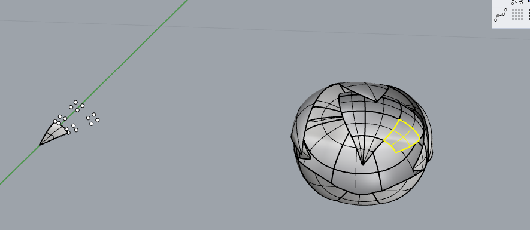

```matlab
1 = [0.502057,2.81548,0.610584];
2 = [0.610681,2.81548,0.561065];
3 = [0.784043,2.81548,0.415587];
4 = [0.834969,2.81548,0.315974];
5 = [0.466462,2.70197,0.571766];
6 = [0.567097,2.70153,0.525964];
7 = [0.728192,2.70108,0.39197];
8 = [0.775024,2.70067,0.298703];
9 = [0.345512,2.53306,0.468227];
10= [0.421083,2.53575,0.432848];
11= [0.542853,2.54187,0.322249];
12= [0.580299,2.54458,0.245199];
13= [0.27401,2.49295,0.39981];
14= [0.329425,2.49355,0.369489];
15= [0.435621,2.50903,0.274324];
16= [0.461506,2.51028,0.206884];
```

* 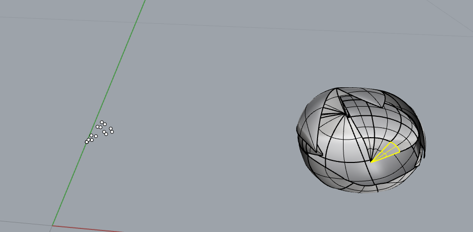

```matlab
1 = [0.27401,2.49295,0.39981];
2 = [0.201282,2.4521,0.323649];
3 = [0.0872601,2.42946,0.149036];
4 = [-1.77636e-15,2.42652,0.006061];
5 = [0.333384,2.49398,0.366415];
6 = [0.25948,2.45542,0.31415];
7 = [0.0371553,2.42591,0.0570815];
8 = [8.88178e-16,2.42652,0.006061];
9 = [0.436191,2.50916,0.273419];
10= [0.317153,2.47225,0.214076];
11= [0.172853,2.44113,0.130544];
12= [-1.77636e-15,2.42652,0.006061];
13= [0.461506,2.51028,0.206884];
14= [0.354066,2.47538,0.170428];
15= [0.0943319,2.43321,0.0481438];
16= [-1.77636e-15,2.42652,0.006061];
```

* 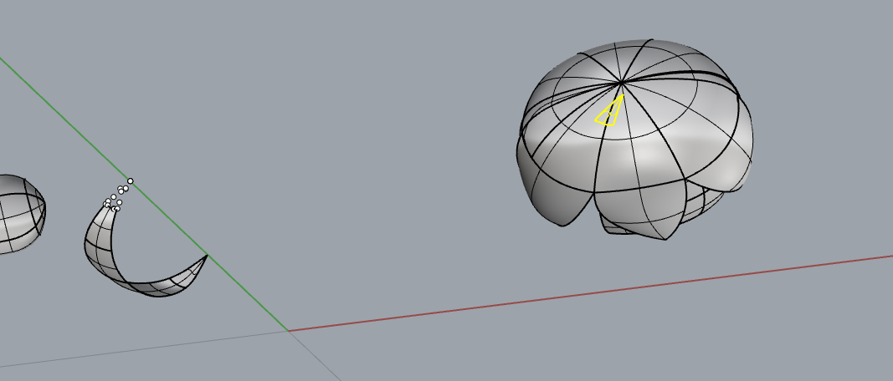

```matlab
1 = [0,4.1344,0.003398];
2 = [-0.104512,4.1365,0.0764499];
3 = [-0.251562,4.09896,0.179939];
4 = [-0.282211,4.08625,0.199577];
5 = [-2.66454e-15,4.1344,0.003398];
6 = [-0.0732502,4.08759,0.0573229];
7 = [-0.174984,4.12543,0.155963];
8 = [-0.251046,4.09089,0.223871];
9 = [-2.66454e-15,4.1344,0.003398];
10= [-0.0730217,4.15521,0.126017];
11= [-0.174675,4.08735,0.274775];
12= [-0.172709,4.0841,0.279551];
13= [-2.66454e-15,4.1344,0.003398];
14= [-0.0364086,4.13733,0.0854277];
15= [-0.0995188,4.10952,0.225372];
16= [-0.127838,4.08888,0.284266];
```

* 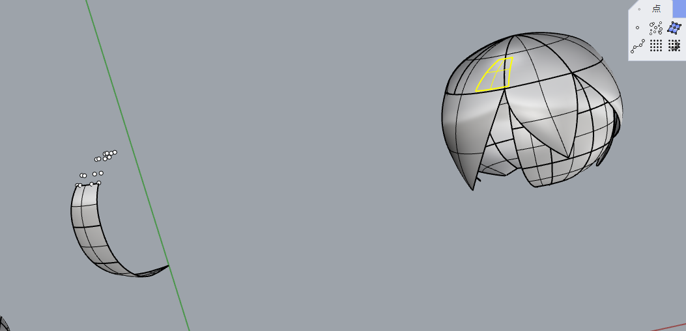

```matlab
1 = [-0.282211,4.08625,0.199577];
2 = [-0.246477,4.09079,0.227004];
3 = [-0.176709,4.08417,0.277276];
4 = [-0.127838,4.08888,0.284266];
5 = [-0.382929,4.04752,0.262478];
6 = [-0.338211,4.05362,0.302082];
7 = [-0.238207,4.04474,0.36557];
8 = [-0.174663,4.05106,0.378991];
9 = [-0.579646,3.90977,0.359337];
10= [-0.521353,3.90758,0.423491];
11= [-0.356675,3.91077,0.512559];
12= [-0.267382,3.9085,0.539122];
13= [-0.659995,3.80715,0.394872];
14= [-0.591566,3.80716,0.466571];
15= [-0.40697,3.80715,0.56962];
16= [-0.303791,3.80715,0.598473];
```

* 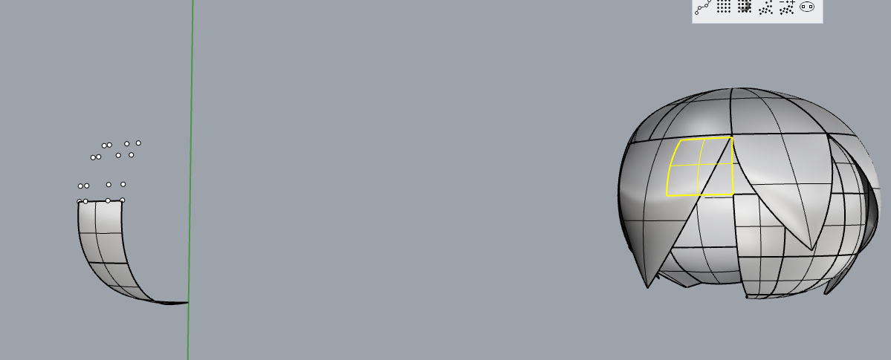

```matlab
1 = [-0.659995,3.80715,0.394872];
2 = [-0.589978,3.80715,0.467606];
3 = [-0.408159,3.80715,0.568974];
4 = [-0.303791,3.80715,0.598473];
5 = [-0.741182,3.70425,0.432561];
6 = [-0.662553,3.70425,0.514059];
7 = [-0.458366,3.70425,0.627877];
8 = [-0.341162,3.70425,0.660946];
9 = [-0.827813,3.4575,0.470204];
10= [-0.739992,3.4575,0.560639];
11= [-0.511941,3.4575,0.688714];
12= [-0.381036,3.4575,0.726233];
13= [-0.833578,3.32612,0.471426];
14= [-0.745146,3.32612,0.562247];
15= [-0.515506,3.32612,0.691759];
16= [-0.38369,3.32612,0.729893];
```

* 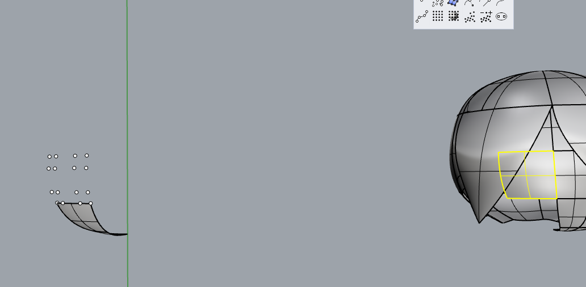

```matlab
1 = [-0.833578,3.32612,0.471426];
2 = [-0.745043,3.32612,0.562316];
3 = [-0.515518,3.32612,0.691749];
4 = [-0.38369,3.32612,0.729893];
5 = [-0.842316,3.19451,0.474637];
6 = [-0.752853,3.19451,0.566334];
7 = [-0.520921,3.19451,0.697426];
8 = [-0.387712,3.19451,0.736165];
9 = [-0.807781,2.93433,0.461947];
10= [-0.721986,2.93433,0.550455];
11= [-0.499563,2.93433,0.674986];
12= [-0.371816,2.93433,0.711375];
13= [-0.751381,2.81548,0.436725];
14= [-0.671577,2.81548,0.519295];
15= [-0.464684,2.81548,0.634821];
16= [-0.345856,2.81548,0.668489];
```

* 

```matlab
1 = [-0.751381,2.81548,0.436725];
2 = [-0.674036,2.81548,0.517619];
3 = [-0.465056,2.81548,0.634762];
4 = [-0.345856,2.81548,0.668489];
5 = [-0.698833,2.70244,0.411702];
6 = [-0.626818,2.70262,0.48644];
7 = [-0.43289,2.70354,0.594748];
8 = [-0.321737,2.70342,0.62591];
9 = [-0.521579,2.54179,0.338814];
10= [-0.466825,2.53884,0.401141];
11= [-0.320381,2.53269,0.486903];
12= [-0.238893,2.53228,0.510779];
13= [-0.415028,2.50575,0.2879];
14= [-0.365499,2.49699,0.341503];
15= [-0.254876,2.4924,0.415406];
16= [-0.187422,2.4873,0.433386];
```

* 

```matlab
1 = [-0.415028,2.50575,0.2879];
2 = [-0.305473,2.46812,0.231196];
3 = [-0.131965,2.43667,0.103874];
4 = [8.88178e-16,2.42652,0.006061];
5 = [-0.369403,2.49729,0.338432];
6 = [-0.283968,2.45918,0.289735];
7 = [-0.0482387,2.42799,0.0411245];
8 = [-1.77636e-15,2.42652,0.006061];
9 = [-0.255527,2.49239,0.415231];
10= [-0.180763,2.45005,0.326426];
11= [-0.107438,2.43056,0.191163];
12= [8.88178e-16,2.42652,0.006061];
13= [-0.187422,2.4873,0.433386];
14= [-0.140547,2.44509,0.359655];
15= [-0.037506,2.42576,0.103286];
16= [8.88178e-16,2.42652,0.006061];
```

* 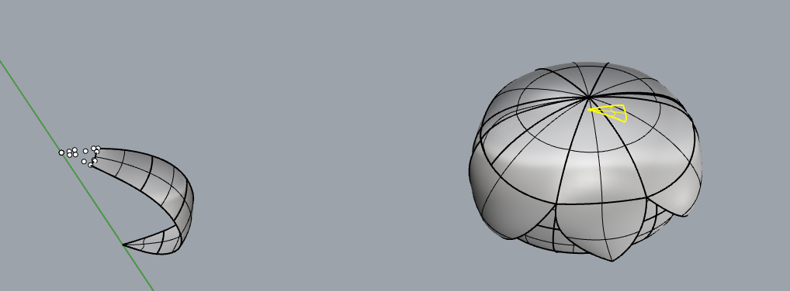

```matlab
1 = [-8.88178e-16,4.1344,0.003398];
2 = [0.0912383,4.13684,0.0430805];
3 = [0.240685,4.1094,0.114307];
4 = [0.308628,4.08888,0.145557];
5 = [-8.88178e-16,4.1344,0.003398];
6 = [0.150081,4.13502,0.042882];
7 = [0.328236,4.09097,0.0917986];
8 = [0.337012,4.08428,0.0978491];
9 = [-8.88178e-16,4.1344,0.003398];
10= [0.0774849,4.1376,-0.000149095];
11= [0.232656,4.11709,-0.00442111];
12= [0.333345,4.0908,-0.00576967];
13= [-8.88178e-16,4.1344,0.003398];
14= [0.127306,4.1358,-0.0171666];
15= [0.297072,4.09885,-0.0478109];
16= [0.332891,4.08625,-0.054592];
```

* 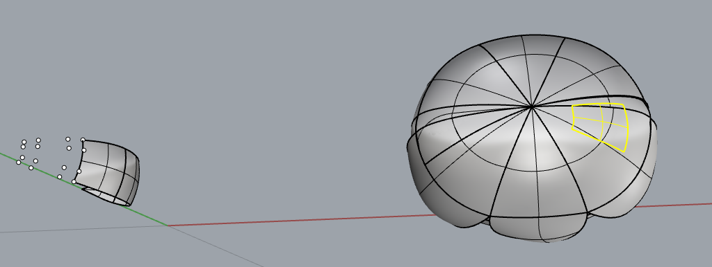

```matlab
1 = [0.308628,4.08888,0.145557];
2 = [0.336916,4.08426,0.098534];
3 = [0.333396,4.09079,-0.00526496];
4 = [0.332891,4.08625,-0.054592];
5 = [0.423479,4.05001,0.195591];
6 = [0.456693,4.04383,0.129569];
7 = [0.459774,4.05256,-0.0121851];
8 = [0.453578,4.04649,-0.0750059];
9 = [0.643599,3.90986,0.262436];
10= [0.680733,3.91205,0.171998];
11= [0.704256,3.90895,-0.0194376];
12= [0.681735,3.91111,-0.113204];
13= [0.733417,3.80716,0.287159];
14= [0.778614,3.80715,0.187736];
15= [0.801352,3.80715,-0.0230575];
16= [0.778517,3.80715,-0.129495];
```

* 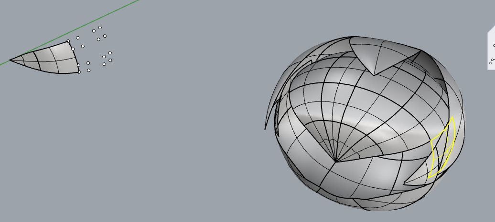

```matlab
1 = [0.92631,3.32612,0.339729];
2 = [0.98362,3.32612,0.221574];
3 = [1.01219,3.32612,-0.0378246];
4 = [0.983272,3.32612,-0.167209];
5 = [0.936069,3.19413,0.341919];
6 = [0.993982,3.19413,0.223015];
7 = [1.02285,3.19413,-0.0384959];
8 = [0.993631,3.19413,-0.169701];
9 = [0.897104,2.93219,0.333174];
10= [0.952606,2.93219,0.217262];
11= [0.980277,2.93219,-0.0358152];
12= [0.95227,2.93219,-0.159752];
13= [0.834969,2.81548,0.315974];
14= [0.886627,2.81548,0.206265];
15= [0.91238,2.81548,-0.0328761];
16= [0.886314,2.81548,-0.147934];
```

* 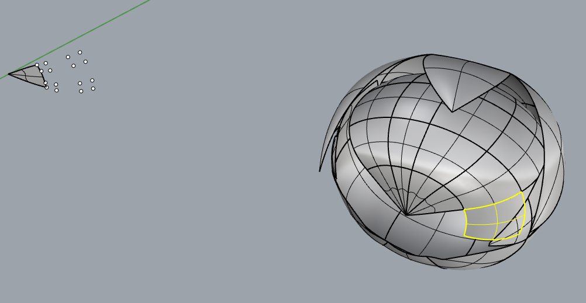

```matlab
1 = [0.834969,2.81548,0.315974];
2 = [0.886208,2.81548,0.207412];
3 = [0.912372,2.81548,-0.0283849];
4 = [0.886314,2.81548,-0.147934];
5 = [0.773334,2.69882,0.298245];
6 = [0.821062,2.69881,0.196213];
7 = [0.844835,2.69861,-0.0258969];
8 = [0.821026,2.69876,-0.136684];
9 = [0.578422,2.54353,0.244653];
10= [0.613632,2.5447,0.159973];
11= [0.632943,2.54526,-0.0180533];
12= [0.614005,2.54476,-0.100817];
13= [0.461506,2.51028,0.206884];
14= [0.495919,2.51508,0.134779];
15= [0.503106,2.51207,-0.0135806];
16= [0.493654,2.51397,-0.079976];
```

* 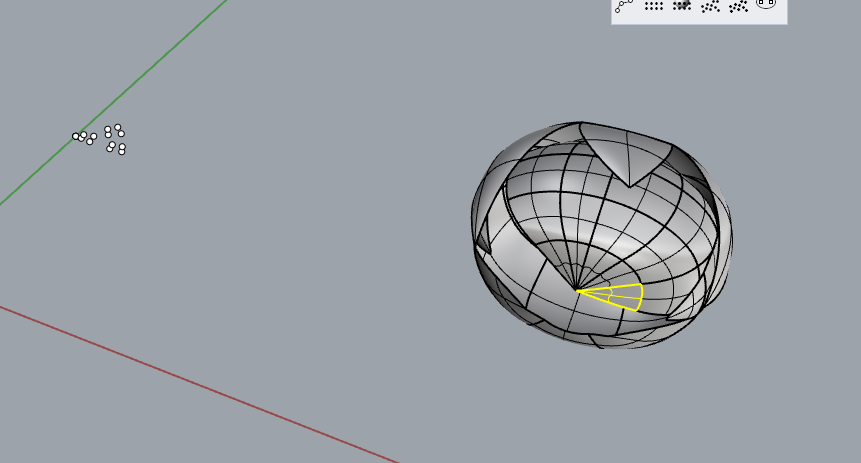

```matlab
1 = [0.461506,2.51028,0.206884];
2 = [0.359193,2.47646,0.17266];
3 = [0.0961952,2.43338,0.0490826];
4 = [0,2.42652,0.006061];
5 = [0.49549,2.51508,0.137116];
6 = [0.364742,2.48026,0.107564];
7 = [0.205424,2.44797,0.0566313];
8 = [1.77636e-15,2.42652,0.006061];
9 = [0.503205,2.5121,-0.0119687];
10= [0.401608,2.48102,-0.00515321];
11= [0.0651477,2.43099,0.000926951];
12= [0,2.42652,0.006061];
13= [0.493654,2.51397,-0.079976];
14= [0.372819,2.48008,-0.0600759];
15= [0.160686,2.44304,-0.0211393];
16= [1.77636e-15,2.42652,0.006061];
```

* 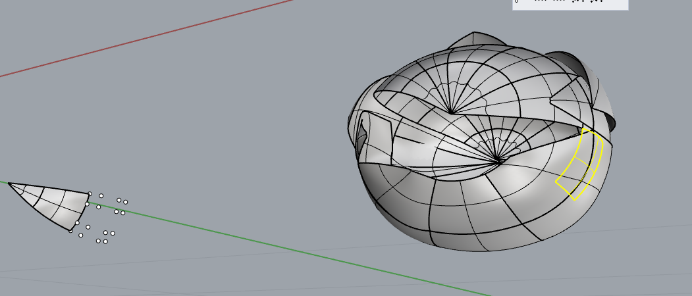

```matlab
1 = [0.983272,3.32612,-0.167209];
2 = [0.953278,3.32612,-0.295046];
3 = [0.811965,3.32612,-0.519536];
4 = [0.708967,3.32612,-0.607216];
5 = [0.993608,3.19396,-0.169696];
6 = [0.963299,3.19396,-0.299341];
7 = [0.8205,3.19396,-0.527119];
8 = [0.71642,3.19396,-0.616077];
9 = [0.952316,2.93239,-0.159761];
10= [0.923268,2.93239,-0.282182];
11= [0.786402,2.93239,-0.496822];
12= [0.686646,2.93239,-0.580677];
13= [0.886314,2.81548,-0.147934];
14= [0.859278,2.81548,-0.261545];
15= [0.731899,2.81548,-0.460427];
16= [0.639058,2.81548,-0.538144];
```

* 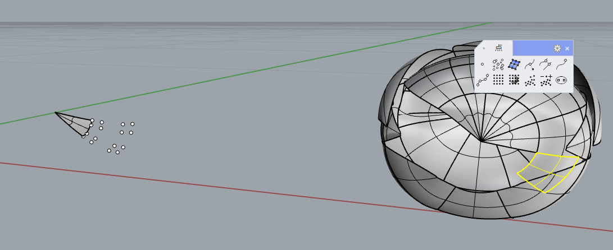

```matlab
1 = [0.886314,2.81548,-0.147934];
2 = [0.859228,2.81548,-0.261691];
3 = [0.731503,2.81548,-0.460934];
4 = [0.639058,2.81548,-0.538144];
5 = [0.82088,2.69866,-0.136659];
6 = [0.79547,2.69852,-0.241851];
7 = [0.677898,2.69908,-0.426212];
8 = [0.592074,2.69905,-0.497406];
9 = [0.6145,2.54505,-0.100902];
10= [0.6145,2.54505,-0.100902];
11= [0.504114,2.54131,-0.31559];
12= [0.439988,2.54037,-0.369054];
13= [0.493654,2.51397,-0.079976];
14= [0.474038,2.51159,-0.140819];
15= [0.405044,2.50915,-0.251894];
16= [0.347985,2.50439,-0.291121];
```

* 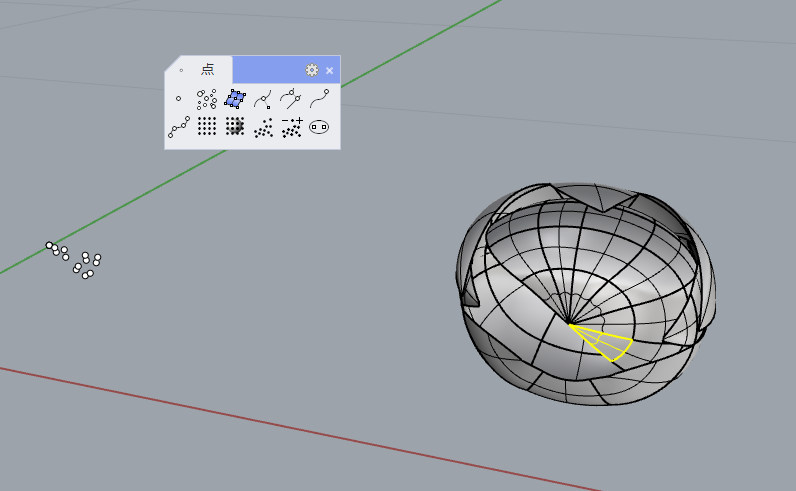

```matlab
1 = [0.493654,2.51397,-0.079976];
2 = [0.375083,2.48054,-0.060477];
3 = [0.159554,2.44283,-0.0209406];
4 = [8.88178e-16,2.42652,0.006061];
5 = [0.475751,2.51169,-0.137895];
6 = [0.381554,2.48009,-0.111442];
7 = [0.0603527,2.42999,-0.0080863];
8 = [-1.77636e-15,2.42652,0.006061];
9 = [0.402926,2.50904,-0.254772];
10= [0.295052,2.4729,-0.186969];
11= [0.169074,2.44478,-0.0975342];
12= [-1.77636e-15,2.42652,0.006061];
13= [0.347985,2.50439,-0.291121];
14= [0.270451,2.46992,-0.225646];
15= [0.0721166,2.4333,-0.0575544];
16= [8.88178e-16,2.42652,0.006061];
```

* 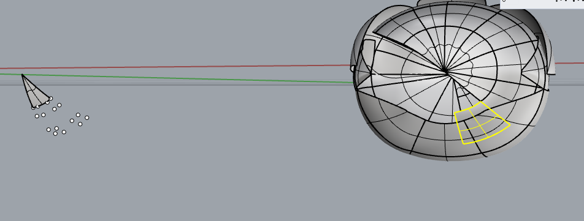

```matlab
1 = [0.639058,2.81548,-0.538144];
2 = [0.541286,2.81548,-0.619408];
3 = [0.306143,2.81548,-0.724809];
4 = [0.176299,2.81548,-0.746241];
5 = [0.592688,2.69998,-0.497927];
6 = [0.50231,2.70026,-0.573394];
7 = [0.283892,2.69998,-0.670508];
8 = [0.163578,2.70017,-0.690651];
9 = [0.441136,2.54125,-0.370023];
10= [0.372198,2.53979,-0.425114];
11= [0.211097,2.54057,-0.498688];
12= [0.121306,2.54004,-0.512551];
13= [0.347985,2.50439,-0.291121];
14= [0.296297,2.50537,-0.338949];
15= [0.164775,2.50168,-0.390291];
16= [0.096159,2.5043,-0.406271];
```

* 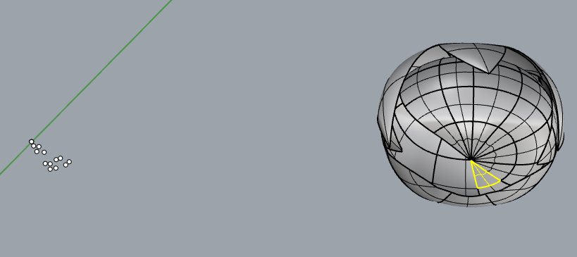

```matlab
1 = [0.347985,2.50439,-0.291121];
2 = [0.272212,2.47036,-0.227136];
3 = [0.0719748,2.43323,-0.0574348];
4 = [-8.88178e-16,2.42652,0.006061];
5 = [0.294389,2.50535,-0.339876];
6 = [0.216989,2.46858,-0.249301];
7 = [0.113144,2.44098,-0.136655];
8 = [-8.88178e-16,2.42652,0.006061];
9 = [0.16739,2.5017,-0.389307];
10= [0.134652,2.46739,-0.31067];
11= [0.0145573,2.42784,-0.0460975];
12= [8.88178e-16,2.42652,0.006061];
13= [0.096159,2.5043,-0.406271];
14= [0.0723968,2.46848,-0.306132];
15= [0.0303395,2.43634,-0.127542];
16= [-8.88178e-16,2.42652,0.006061];
```

* 

```matlab
1 = [-0.345856,2.81548,-0.703028];
2 = [-0.220239,2.81548,-0.746295];
3 = [0.0443734,2.81548,-0.76828];
4 = [0.176299,2.81548,-0.746241];
5 = [-0.321124,2.70088,-0.651117];
6 = [-0.204566,2.70107,-0.691523];
7 = [0.0412178,2.7008,-0.711406];
8 = [0.163738,2.70099,-0.69133];
9 = [-0.238538,2.54077,-0.484017];
10= [-0.151697,2.54025,-0.512883];
11= [0.0305574,2.541,-0.52933];
12= [0.121469,2.54047,-0.513238];
13= [-0.187422,2.50281,-0.380281];
14= [-0.120357,2.50541,-0.408255];
15= [0.0242802,2.50168,-0.413595];
16= [0.096159,2.5043,-0.406271];
```

* 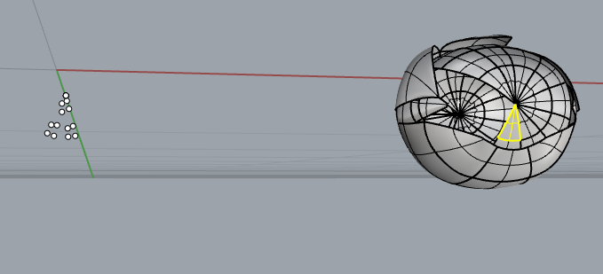

```matlab
1 = [-0.187422,2.50281,-0.380281];
2 = [-0.14593,2.46784,-0.296798];
3 = [-0.0381274,2.43169,-0.0752815];
4 = [-1.77636e-15,2.42653,0.006061];
5 = [-0.119394,2.5054,-0.408387];
6 = [-0.0890491,2.469,-0.300123];
7 = [-0.0416539,2.43986,-0.162396];
8 = [-1.77636e-15,2.42653,0.006061];
9 = [0.0241942,2.50168,-0.413559];
10= [0.0179225,2.46745,-0.330775];
11= [0.00898506,2.42775,-0.0467077];
12= [-8.88178e-16,2.42652,0.006061];
13= [0.096159,2.5043,-0.406271];
14= [0.0724533,2.46853,-0.306372];
15= [0.0302922,2.4363,-0.127339];
16= [1.77636e-15,2.42652,0.006061];
```

* 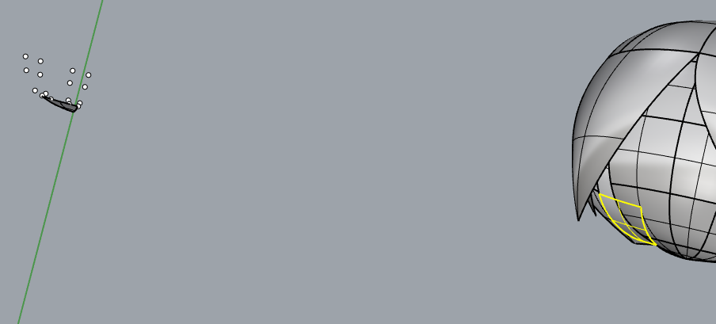

```matlab
1 = [-0.751381,2.81548,-0.422836];
2 = [-0.67464,2.81548,-0.518722];
3 = [-0.467289,2.81548,-0.660936];
4 = [-0.345856,2.81548,-0.703028];
5 = [-0.696462,2.6994,-0.391129];
6 = [-0.625251,2.69943,-0.479587];
7 = [-0.433458,2.6998,-0.611476];
8 = [-0.320637,2.6996,-0.650125];
9 = [-0.519664,2.5427,-0.290186];
10= [-0.465489,2.54115,-0.356625];
11= [-0.320724,2.53931,-0.453231];
12= [-0.237986,2.54002,-0.482902];
13= [-0.415028,2.50922,-0.230251];
14= [-0.415028,2.50922,-0.230251];
15= [-0.256075,2.50512,-0.361395];
16= [-0.187422,2.50281,-0.380281];
```

* 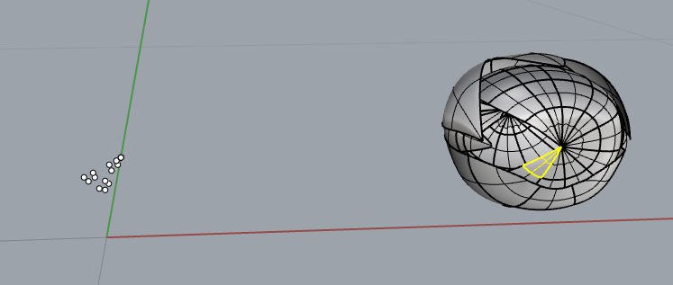

```matlab
1 = [-0.415028,2.50922,-0.230251];
2 = [-0.315074,2.47472,-0.173543];
3 = [-0.132693,2.43995,-0.0716975];
4 = [-2.66454e-15,2.42653,0.006061];
5 = [-0.369731,2.5034,-0.276057];
6 = [-0.295413,2.47044,-0.221655];
7 = [-0.0495401,2.42949,-0.0259184];
8 = [-2.66454e-15,2.42653,0.006061];
9 = [-0.254102,2.50509,-0.362714];
10= [-0.184451,2.46795,-0.266957];
11= [-0.107687,2.44076,-0.141052];
12= [-0.107687,2.44076,-0.141052];
13= [-0.187422,2.50281,-0.380281];
14= [-0.145726,2.46774,-0.296382];
15= [-0.0379695,2.43166,-0.0749537];
16= [-2.66454e-15,2.42653,0.006061];
```

* 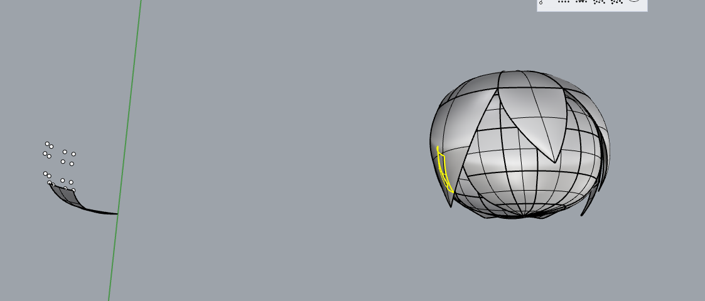

```matlab
1 = [-1.00263,3.32612,0.003679];
2 = [-1.00271,3.32612,-0.126653];
3 = [-0.915336,3.32612,-0.373435];
4 = [-0.833578,3.32612,-0.4771];
5 = [-1.01318,3.19403,0.00325735];
6 = [-1.01327,3.19403,-0.128494];
7 = [-0.924971,3.19403,-0.378892];
8 = [-0.842352,3.19403,-0.484069];
9 = [-0.971015,2.93219,0.00494217];
10= [-0.971093,2.93219,-0.121136];
11= [-0.886473,2.93219,-0.357087];
12= [-0.807292,2.93219,-0.456222];
13= [-0.903764,2.81548,0.005874];
14= [-0.903837,2.81548,-0.112296];
15= [-0.825077,2.81548,-0.330952];
16= [-0.751381,2.81548,-0.422836];
```

* 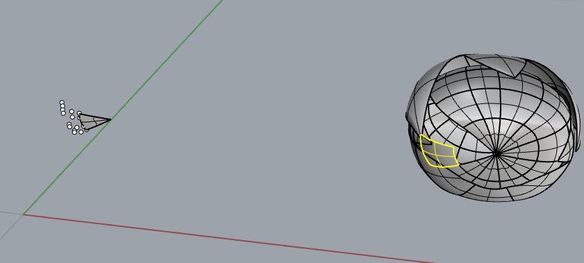

```matlab
1 = [-0.903764,2.81548,0.005874];
2 = [-0.904504,2.81548,-0.10974];
3 = [-0.824991,2.81548,-0.331381];
4 = [-0.751381,2.81548,-0.422836];
5 = [-0.836831,2.69853,0.00659778];
6 = [-0.837834,2.69866,-0.101511];
7 = [-0.763798,2.69856,-0.306257];
8 = [-0.696105,2.69891,-0.390925];
9 = [-0.626842,2.54522,0.00872675];
10= [-0.626598,2.545,-0.0751053];
11= [-0.57212,2.54442,-0.227273];
12= [-0.51858,2.54198,-0.289567];
13= [-0.500461,2.51293,0.009053];
14= [-0.506152,2.51538,-0.060411];
15= [-0.45394,2.51032,-0.178726];
16= [-0.415028,2.50922,-0.230251];
```

* 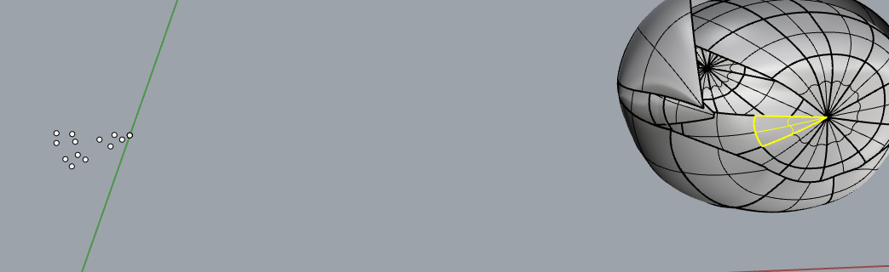

```matlab
1 = [-0.500461,2.51293,0.009053];
2 = [-0.392009,2.48101,0.0102967];
3 = [-0.10497,2.43585,0.00920646];
4 = [-1.77636e-15,2.42653,0.006061];
5 = [-0.506208,2.5154,-0.0598158];
6 = [-0.374576,2.48097,-0.043503];
7 = [-0.20703,2.44896,-0.0249485];
8 = [0,2.42652,0.006061];
9 = [-0.455374,2.51043,-0.176056];
10= [-0.364254,2.47818,-0.138677];
11= [-0.0544205,2.4294,-0.0237561];
12= [0,2.42652,0.006061];
13= [-0.415028,2.50922,-0.230251];
14= [-0.312487,2.47412,-0.172088];
15= [-0.134195,2.44024,-0.0725493];
16= [0,2.42652,0.006061];
```

* 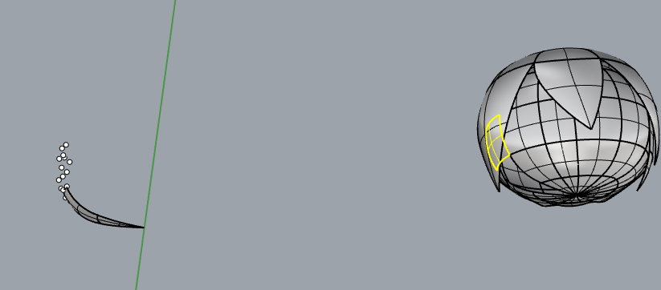

```matlab
1 = [-0.833578,3.32612,0.471426];
2 = [-0.919567,3.32612,0.378475];
3 = [-1.0026,3.32612,0.136308];
4 = [-1.00263,3.32612,0.003679];
5 = [-0.842355,3.1942,0.474657];
6 = [-0.929249,3.1942,0.380894];
7 = [-1.01316,3.1942,0.137136];
8 = [-1.01319,3.1942,0.00325682];
9 = [-0.807362,2.93248,0.461775];
10= [-0.890647,2.93248,0.371252];
11= [-0.971072,2.93248,0.133834];
12= [-0.971099,2.93248,0.00493998];
13= [-0.751381,2.81548,0.436725];
14= [-0.828891,2.81548,0.352172];
15= [-0.903739,2.81548,0.12727];
16= [-0.903764,2.81548,0.005874];
```

* 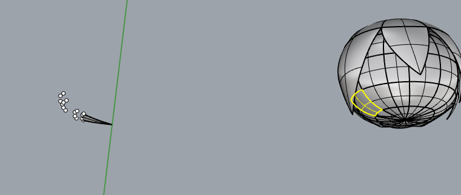

```matlab
1 = [-0.751381,2.81548,0.436725];
2 = [-0.829725,2.81548,0.350275];
3 = [-0.903222,2.81548,0.129007];
4 = [-0.903764,2.81548,0.005874];
5 = [-0.696492,2.69955,0.410735];
6 = [-0.768604,2.69903,0.330838];
7 = [-0.83711,2.69907,0.122324];
8 = [-0.837291,2.69895,0.00659305];
9 = [-0.518574,2.53984,0.337517];
10= [-0.575442,2.5439,0.271413];
11= [-0.625678,2.54504,0.0998837];
12= [-0.626834,2.54518,0.00872689];
13= [-0.415028,2.50575,0.2879];
14= [-0.456785,2.50953,0.229003];
15= [-0.505427,2.51553,0.0844014];
16= [-0.500461,2.51293,0.009053];
```

* 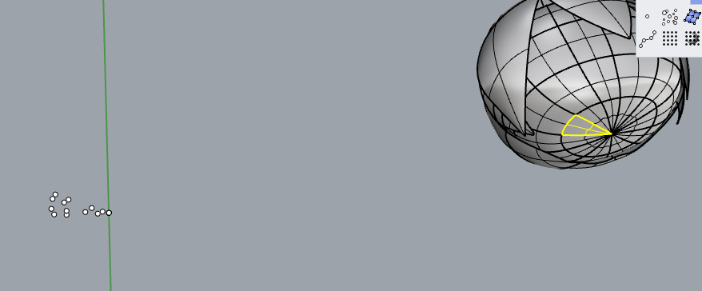

```matlab
1 = [-0.415028,2.50575,0.2879];
2 = [-0.310812,2.46945,0.234668];
3 = [-0.134067,2.43682,0.105598];
4 = [-8.88178e-16,2.42652,0.006061];
5 = [-0.455998,2.50943,0.230576];
6 = [-0.362279,2.47596,0.194915];
7 = [-0.0542766,2.42798,0.0384918];
8 = [-8.88178e-16,2.42652,0.006061];
9 = [-0.504975,2.51549,0.086736];
10= [-0.372151,2.48102,0.0657538];
11= [-0.205158,2.44828,0.0497906];
12= [-8.88178e-16,2.42652,0.006061];
13= [-0.500461,2.51293,0.009053];
14= [-0.389594,2.48055,0.0102971];
15= [-0.104734,2.43585,0.00919976];
16= [8.88178e-16,2.42652,0.006061];
```

* 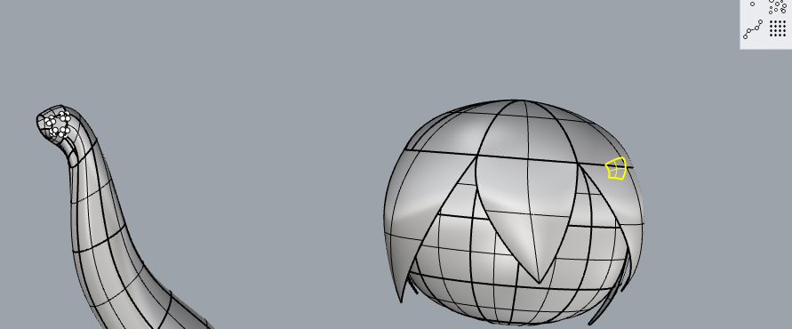

```matlab
1 = [0.811881,3.82774,-0.366163];
2 = [0.83704,3.80255,-0.353135];
3 = [0.861977,3.73938,-0.364065];
4 = [0.857452,3.71225,-0.387167];
5 = [0.848965,3.85211,-0.372496];
6 = [0.873262,3.82233,-0.35619];
7 = [0.891423,3.74706,-0.363043];
8 = [0.881915,3.71466,-0.383122];
9 = [0.929168,3.89526,-0.386745];
10= [0.95261,3.85657,-0.364048];
11= [0.959675,3.75729,-0.363208];
12= [0.941169,3.71455,-0.37917];
13= [0.973133,3.90289,-0.394685];
14= [0.996151,3.86087,-0.369023];
15= [0.999278,3.75255,-0.364989];
16= [0.977594,3.70604,-0.38087];
```

* 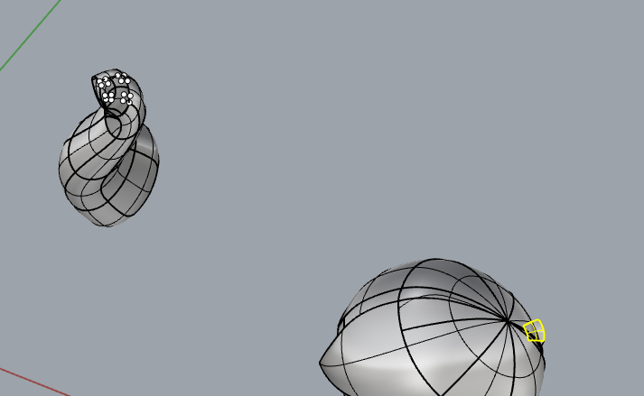

```matlab
1 = [0.694706,3.86905,-0.471728];
2 = [0.721051,3.87796,-0.436826];
3 = [0.782863,3.85531,-0.381716];
4 = [0.811881,3.82774,-0.366163];
5 = [0.723519,3.89933,-0.497008];
6 = [0.753843,3.90961,-0.458363];
7 = [0.819073,3.8833,-0.392392];
8 = [0.847263,3.85103,-0.372198];
9 = [0.788417,3.95559,-0.546705];
10= [0.826176,3.96846,-0.500988];
11= [0.898568,3.93536,-0.4151];
12= [0.925935,3.89387,-0.386166];
13= [0.830881,3.9701,-0.56995];
14= [0.871562,3.98395,-0.52146];
15= [0.946291,3.94816,-0.427526];
16= [0.973133,3.90289,-0.394685];
```

* 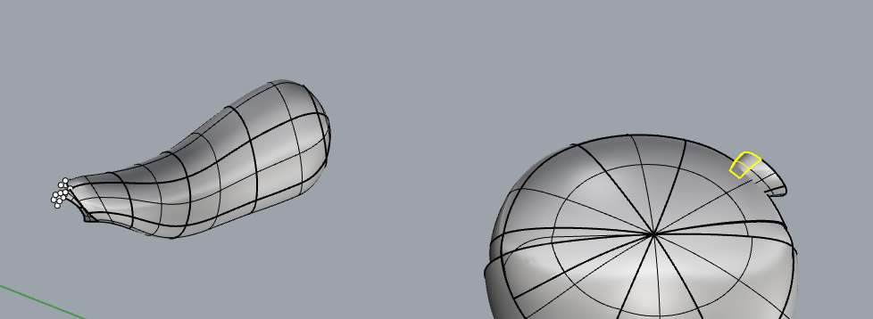

```matlab
1 = [0.694706,3.86905,-0.471728];
2 = [0.723385,3.89924,-0.496914];
3 = [0.788972,3.95598,-0.547094];
4 = [0.830881,3.9701,-0.56995];
5 = [0.656302,3.8567,-0.520933];
6 = [0.679984,3.88499,-0.551709];
7 = [0.735953,3.93814,-0.612325];
8 = [0.774008,3.95103,-0.638893];
9 = [0.651686,3.77394,-0.566162];
10= [0.669138,3.78698,-0.594952];
11= [0.713038,3.80869,-0.650574];
12= [0.743786,3.81004,-0.674006];
13= [0.671439,3.73936,-0.572055];
14= [0.682493,3.74617,-0.595699];
15= [0.715614,3.75481,-0.643216];
16= [0.742805,3.75074,-0.665164];
```

* 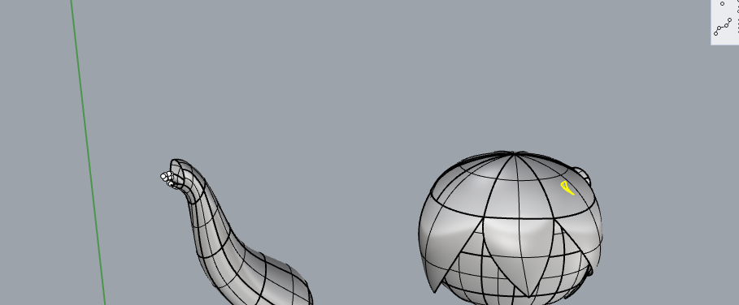

```matlab
1 = [0.671439,3.73936,-0.572055];
2 = [0.684341,3.74697,-0.598919];
3 = [0.720079,3.75526,-0.648491];
4 = [0.742805,3.75074,-0.665164];
5 = [0.69132,3.70711,-0.575853];
6 = [0.697736,3.70813,-0.597077];
7 = [0.723533,3.70384,-0.638516];
8 = [0.744106,3.69563,-0.65435];
9 = [0.74934,3.66558,-0.53988];
10= [0.754275,3.65878,-0.548392];
11= [0.778676,3.64049,-0.569033];
12= [0.799949,3.62828,-0.579858];
13= [0.778536,3.66076,-0.509617];
14= [0.786608,3.65309,-0.512723];
15= [0.816538,3.63346,-0.523979];
16= [0.839439,3.62075,-0.532085];
```

* 

```matlab
1 = [0.857452,3.71225,-0.387167];
2 = [0.885208,3.71484,-0.38276];
3 = [0.947089,3.71412,-0.37901];
4 = [0.977594,3.70604,-0.38087];
5 = [0.851445,3.68308,-0.413264];
6 = [0.873087,3.67934,-0.405568];
7 = [0.924874,3.66726,-0.397875];
8 = [0.952744,3.65612,-0.400037];
9 = [0.808576,3.65641,-0.478725];
10= [0.820111,3.64748,-0.475977];
11= [0.855149,3.62634,-0.477415];
12= [0.879073,3.61322,-0.482827];
13= [0.778536,3.66076,-0.509617];
14= [0.787038,3.65278,-0.512886];
15= [0.816913,3.63324,-0.524117];
16= [0.839439,3.62075,-0.532085];
```

* 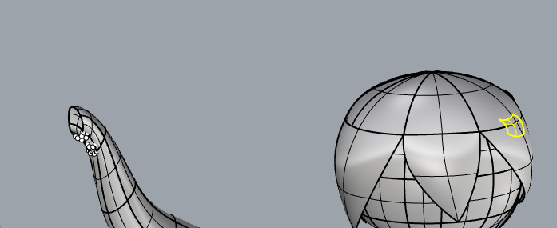

```matlab
1 = [0.977594,3.70604,-0.38087];
2 = [1.02887,3.68826,-0.382356];
3 = [1.10806,3.56049,-0.381681];
4 = [1.10976,3.46625,-0.390063];
5 = [0.952874,3.6561,-0.399877];
6 = [0.999274,3.6341,-0.401253];
7 = [1.07257,3.52012,-0.403028];
8 = [1.07012,3.43165,-0.416899];
9 = [0.877296,3.61253,-0.484878];
10= [0.916931,3.58825,-0.492189];
11= [0.995419,3.49358,-0.502412];
12= [0.995481,3.41341,-0.517391];
13= [0.839439,3.62075,-0.532085];
14= [0.876734,3.59796,-0.544276];
15= [0.95534,3.50961,-0.563271];
16= [0.960782,3.43126,-0.580445];
```

* 

```matlab
1 = [0.742805,3.75074,-0.665164];
2 = [0.781252,3.74109,-0.694936];
3 = [0.876959,3.65044,-0.753372];
4 = [0.90891,3.57576,-0.790707];
5 = [0.745233,3.69309,-0.652649];
6 = [0.77822,3.6782,-0.679961];
7 = [0.851649,3.59996,-0.734147];
8 = [0.8761,3.52561,-0.767682];
9 = [0.800617,3.62816,-0.579074];
10= [0.835006,3.60667,-0.596372];
11= [0.910988,3.5242,-0.626428];
12= [0.920467,3.44938,-0.64691];
13= [0.839439,3.62075,-0.532085];
14= [0.876858,3.59792,-0.544293];
15= [0.956705,3.50762,-0.563694];
16= [0.960782,3.43126,-0.580445];
```

* 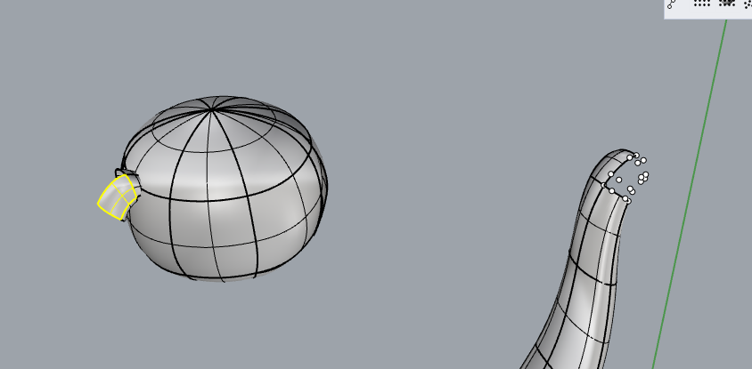

```matlab
1 = [0.830881,3.9701,-0.56995];
2 = [0.903799,3.97148,-0.604991];
3 = [1.07771,3.81693,-0.658613];
4 = [1.13807,3.70324,-0.686474];
5 = [0.774994,3.95358,-0.637747];
6 = [0.842747,3.95372,-0.677647];
7 = [1.01335,3.80086,-0.733149];
8 = [1.07617,3.69351,-0.768008];
9 = [0.743558,3.80909,-0.674218];
10= [0.794035,3.80107,-0.709591];
11= [0.899956,3.7071,-0.762391];
12= [0.947482,3.62496,-0.807929];
13= [0.742805,3.75074,-0.665164];
14= [0.786178,3.73763,-0.698314];
15= [0.870151,3.65693,-0.748681];
16= [0.90891,3.57576,-0.790707];
```

* 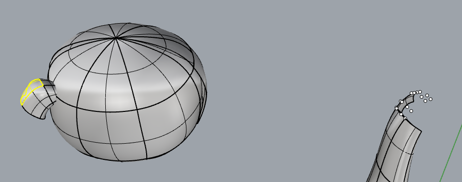

```matlab
1 = [0.973133,3.90289,-0.394685];
2 = [1.04885,3.89569,-0.40729];
3 = [1.1715,3.7436,-0.422131];
4 = [1.21118,3.62207,-0.430248];
5 = [0.946106,3.94826,-0.427755];
6 = [1.02535,3.94547,-0.447061];
7 = [1.16975,3.7904,-0.474846];
8 = [1.21972,3.66678,-0.48805];
9 = [0.872086,3.9838,-0.520813];
10= [0.951723,3.98492,-0.553136];
11= [1.12168,3.83382,-0.60284];
12= [1.1847,3.71235,-0.627275];
13= [0.830881,3.9701,-0.56995];
14= [0.906359,3.97011,-0.605976];
15= [1.0736,3.82043,-0.657171];
16= [1.13807,3.70324,-0.686474];
```

* 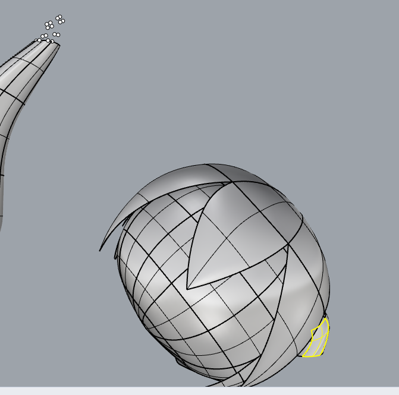

```matlab
1 = [0.977594,3.70604,-0.38087];
2 = [0.999249,3.75209,-0.365002];
3 = [0.996128,3.8612,-0.369056];
4 = [0.973133,3.90289,-0.394685];
5 = [1.03258,3.68454,-0.382405];
6 = [1.05897,3.73436,-0.36673];
7 = [1.06475,3.85313,-0.37601];
8 = [1.04443,3.89875,-0.406646];
9 = [1.10529,3.56417,-0.381599];
10= [1.13674,3.60181,-0.363862];
11= [1.17726,3.69591,-0.381537];
12= [1.17761,3.73666,-0.422977];
13= [1.10976,3.46625,-0.390063];
14= [1.1454,3.49842,-0.366978];
15= [1.20234,3.58334,-0.384686];
16= [1.21118,3.62207,-0.430248];
```

* 

```matlab
1 = [1.10976,3.46625,-0.390063];
2 = [1.14442,3.49699,-0.366721];
3 = [1.20403,3.58622,-0.385819];
4 = [1.21118,3.62207,-0.430248];
5 = [1.11432,3.29685,-0.40516];
6 = [1.15683,3.3196,-0.371181];
7 = [1.24593,3.39578,-0.388982];
8 = [1.26579,3.42944,-0.440251];
9 = [1.09976,2.88677,-0.471147];
10= [1.15794,2.90295,-0.417971];
11= [1.28901,2.97507,-0.436101];
12= [1.32391,3.00934,-0.499536];
13= [1.11898,2.65517,-0.530035];
14= [1.18133,2.67271,-0.47494];
15= [1.32169,2.75128,-0.50122];
16= [1.35955,2.78873,-0.570949];
```

```matlab
1 = [0.960782,3.43126,-0.580445];
2 = [0.970323,3.27631,-0.613546];
3 = [0.955125,2.89457,-0.739732];
4 = [0.964425,2.67379,-0.85086];
5 = [0.994653,3.4131,-0.518353];
6 = [0.992773,3.25499,-0.547643];
7 = [0.958605,2.87,-0.660509];
8 = [0.968029,2.64752,-0.757793];
9 = [1.07263,3.43273,-0.414034];
10= [1.06769,3.25936,-0.442414];
11= [1.03655,2.85917,-0.52799];
12= [1.05171,2.63558,-0.586675];
13= [1.10976,3.46625,-0.390063];
14= [1.11407,3.28395,-0.406866];
15= [1.09963,2.8772,-0.473094];
16= [1.11898,2.65517,-0.530035];
```


```matlab
1 = [0.960782,3.43126,-0.580445];
2 = [0.970298,3.27353,-0.614303];
3 = [0.954987,2.89003,-0.74149];
4 = [0.964425,2.67379,-0.85086];
5 = [0.918694,3.4515,-0.650929];
6 = [0.941286,3.29662,-0.693587];
7 = [0.949511,2.91508,-0.838306];
8 = [0.958746,2.70093,-0.957693];
9 = [0.876233,3.52593,-0.767857];
10= [0.93188,3.37335,-0.83894];
11= [0.999872,2.9945,-1.02264];
12= [1.0127,2.7817,-1.14427];
13= [0.90891,3.57576,-0.790707];
14= [0.979772,3.42588,-0.870197];
15= [1.06619,3.0556,-1.06927];
16= [1.083,2.8397,-1.19446];
```

```matlab
1 = [1.13807,3.70324,-0.686474];
2 = [1.0847,3.6977,-0.763987];
3 = [0.944971,3.62326,-0.808536];
4 = [0.90891,3.57576,-0.790707];
5 = [1.2305,3.51776,-0.730503];
6 = [1.18303,3.52269,-0.820462];
7 = [1.02496,3.4889,-0.888251];
8 = [0.975733,3.43842,-0.863506];
9 = [1.33806,3.11254,-0.861896];
10= [1.30234,3.1375,-0.986176];
11= [1.13095,3.12223,-1.10563];
12= [1.06546,3.06199,-1.06574];
13= [1.38015,2.90935,-0.967592];
14= [1.34616,2.93506,-1.10743];
15= [1.15248,2.89639,-1.23855];
16= [1.083,2.8397,-1.19446];
```

```matlab
1 = [1.21118,3.62207,-0.430248];
2 = [1.21961,3.66699,-0.488606];
3 = [1.18496,3.71217,-0.626535];
4 = [1.13807,3.70324,-0.686474];
5 = [1.2641,3.43846,-0.439307];
6 = [1.28711,3.48046,-0.504549];
7 = [1.27072,3.52898,-0.65882];
8 = [1.22691,3.52796,-0.727651];
9 = [1.32353,3.01324,-0.498656];
10= [1.36472,3.05409,-0.575661];
11= [1.37168,3.11007,-0.763052];
12= [1.33564,3.12357,-0.857654];
13= [1.35955,2.78873,-0.570949];
14= [1.40435,2.83344,-0.655248];
15= [1.4155,2.895,-0.860583];
16= [1.38015,2.90935,-0.967592];
```

```matlab
1 = [1.11898,2.65517,-0.530035];
2 = [1.18105,2.67254,-0.474849];
3 = [1.32296,2.75206,-0.501732];
4 = [1.35955,2.78873,-0.570949];
5 = [1.14109,2.3814,-0.600325];
6 = [1.20834,2.40013,-0.541943];
7 = [1.36193,2.4874,-0.577367];
8 = [1.40204,2.52786,-0.653758];
9 = [1.32539,1.84301,-0.878503];
10= [1.39552,1.86967,-0.804336];
11= [1.54554,2.00478,-0.825346];
12= [1.58097,2.06957,-0.905925];
13= [1.48387,1.58496,-1.04004];
14= [1.55401,1.61652,-0.955493];
15= [1.69703,1.78233,-0.961957];
16= [1.72779,1.86287,-1.04244];
```

```matlab
1 = [1.35955,2.78873,-0.570949];
2 = [1.40474,2.834,-0.656633];
3 = [1.41524,2.8958,-0.863889];
4 = [1.38015,2.90935,-0.967592];
5 = [1.3972,2.54387,-0.646258];
6 = [1.44679,2.59294,-0.739968];
7 = [1.46247,2.6605,-0.967005];
8 = [1.42839,2.67533,-1.08405];
9 = [1.57732,2.07623,-0.9016];
10= [1.6213,2.15546,-1.00051];
11= [1.62514,2.26822,-1.25548];
12= [1.5858,2.29504,-1.39485];
13= [1.72779,1.86287,-1.04244];
14= [1.76585,1.96206,-1.14125];
15= [1.75889,2.10499,-1.4071];
16= [1.71531,2.14025,-1.55635];
```

```matlab
1 = [1.38015,2.90935,-0.967592];
2 = [1.34632,2.93428,-1.10544];
3 = [1.15866,2.89898,-1.23727];
4 = [1.083,2.8397,-1.19446];
5 = [1.42711,2.6793,-1.08128];
6 = [1.39593,2.70613,-1.23682];
7 = [1.1855,2.64771,-1.38333];
8 = [1.10418,2.59139,-1.33532];
9 = [1.58443,2.29749,-1.39256];
10= [1.54637,2.34398,-1.57596];
11= [1.32282,2.24233,-1.77451];
12= [1.24488,2.15998,-1.73154];
13= [1.71531,2.14025,-1.55635];
14= [1.67099,2.20072,-1.75152];
15= [1.44976,2.08055,-1.98179];
16= [1.3769,1.97707,-1.94498];
```
```matlab
1 = [1.083,2.8397,-1.19446];
2 = [1.01386,2.78304,-1.14664];
3 = [0.957994,2.69976,-0.955049];
4 = [0.964425,2.67379,-0.85086];
5 = [1.10752,2.57727,-1.3466];
6 = [1.03312,2.52298,-1.29399];
7 = [0.968832,2.4377,-1.09704];
8 = [0.973884,2.40928,-0.980877];
9 = [1.24756,2.15486,-1.73721];
10= [1.17694,2.07547,-1.68867];
11= [1.12362,1.94203,-1.48307];
12= [1.13519,1.89433,-1.35006];
13= [1.3769,1.97707,-1.94498];
14= [1.31115,1.8778,-1.90139];
15= [1.26846,1.70996,-1.69085];
16= [1.28491,1.6493,-1.55106];
```

```matlab
1 = [1.11898,2.65517,-0.530035];
2 = [1.14262,2.37536,-0.602932];
3 = [1.32626,1.84149,-0.879544];
4 = [1.48387,1.58496,-1.04004];
5 = [1.04787,2.63552,-0.592872];
6 = [1.06552,2.3541,-0.670625];
7 = [1.24586,1.81138,-0.96589];
8 = [1.40339,1.5494,-1.13817];
9 = [0.970171,2.6472,-0.753197];
10= [0.981453,2.36802,-0.873702];
11= [1.14971,1.84022,-1.2206];
12= [1.30139,1.58835,-1.41068];
13= [0.964425,2.67379,-0.85086];
14= [0.976482,2.39709,-0.988693];
15= [1.13799,1.88841,-1.35484];
16= [1.28491,1.6493,-1.55106];
```

* 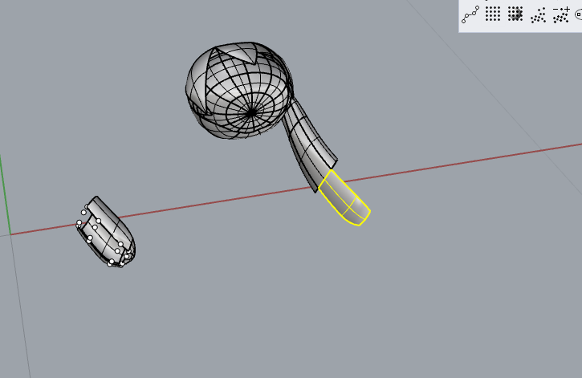

```matlab
1 = [1.48387,1.58496,-1.04004];
2 = [1.40198,1.54946,-1.14108];
3 = [1.30179,1.58833,-1.40984];
4 = [1.28491,1.6493,-1.55106];
5 = [1.64978,1.30859,-1.1979];
6 = [1.56695,1.26746,-1.31221];
7 = [1.45925,1.31638,-1.60394];
8 = [1.43778,1.39093,-1.75408];
9 = [1.98852,0.883726,-1.48804];
10= [1.9082,0.835618,-1.61488];
11= [1.79759,0.898594,-1.92579];
12= [1.76907,0.988347,-2.07997];
13= [2.13868,0.891463,-1.71391];
14= [2.08417,0.858608,-1.80946];
15= [2.00347,0.903541,-2.0313];
16= [1.98499,0.970942,-2.14199];
```

```matlab
1 = [1.48387,1.58496,-1.04004];
2 = [1.55476,1.61723,-0.955238];
3 = [1.6973,1.78276,-0.962174];
4 = [1.72779,1.86287,-1.04244];
5 = [1.65354,1.29915,-1.19918];
6 = [1.72588,1.33735,-1.10275];
7 = [1.86373,1.53718,-1.09531];
8 = [1.89013,1.63481,-1.17752];
9 = [2.00385,0.873393,-1.50551];
10= [2.07149,0.91618,-1.39826];
11= [2.19146,1.14992,-1.37204];
12= [2.20939,1.26494,-1.44843];
13= [2.13868,0.891463,-1.71391];
14= [2.18761,0.923551,-1.63694];
15= [2.27113,1.09602,-1.60851];
16= [2.28385,1.18252,-1.66642];
```

```matlab
1 = [1.72779,1.86287,-1.04244];
2 = [1.76586,1.96208,-1.14126];
3 = [1.75887,2.10506,-1.40727];
4 = [1.71531,2.14025,-1.55635];
5 = [1.89728,1.6261,-1.18277];
6 = [1.92997,1.74785,-1.28324];
7 = [1.91211,1.9244,-1.56604];
8 = [1.86362,1.96909,-1.72838];
9 = [2.21237,1.26161,-1.45275];
10= [2.23499,1.40368,-1.54792];
11= [2.20344,1.61243,-1.82863];
12= [2.15261,1.66527,-1.99607];
13= [2.28385,1.18252,-1.66642];
14= [2.29884,1.29002,-1.73287];
15= [2.27481,1.44475,-1.94154];
16= [2.237,1.48554,-2.06371];
```

```matlab
1 = [1.71531,2.14025,-1.55635];
2 = [1.66992,2.20007,-1.75251];
3 = [1.45099,2.08157,-1.98113];
4 = [1.3769,1.97707,-1.94498];
5 = [1.85858,1.97435,-1.72342];
6 = [1.80648,2.04895,-1.93579];
7 = [1.58487,1.90807,-2.2];
8 = [1.51421,1.78132,-2.16949];
9 = [2.15177,1.66646,-1.99539];
10= [2.0948,1.7557,-2.21247];
11= [1.88848,1.5946,-2.50519];
12= [1.83023,1.44634,-2.48437];
13= [2.237,1.48554,-2.06371];
14= [2.19422,1.55131,-2.22463];
15= [2.04965,1.42775,-2.43705];
16= [2.00792,1.31904,-2.42402];
```

```matlab
1 = [1.3769,1.97707,-1.94498];
2 = [1.31135,1.87836,-1.90199];
3 = [1.26823,1.70878,-1.68922];
4 = [1.28491,1.6493,-1.55106];
5 = [1.51089,1.78688,-2.1594];
6 = [1.44946,1.66835,-2.12034];
7 = [1.4155,1.46334,-1.90107];
8 = [1.43737,1.39082,-1.75405];
9 = [1.81247,1.46214,-2.47827];
10= [1.75986,1.32118,-2.44843];
11= [1.74425,1.07528,-2.23177];
12= [1.77091,0.987257,-2.08108];
13= [2.00792,1.31904,-2.42402];
14= [1.97493,1.21482,-2.40175];
15= [1.96294,1.03503,-2.25032];
16= [1.98499,0.970942,-2.14199];
```

* 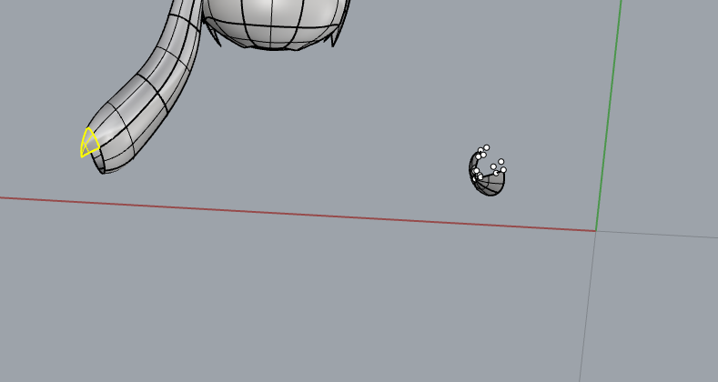

```matlab
1 = [2.237,1.48554,-2.06371];
2 = [2.26646,1.40421,-2.08518];
3 = [2.3031,1.22443,-2.11227];
4 = [2.28444,1.12216,-2.10752];
5 = [2.19717,1.55352,-2.22003];
6 = [2.23175,1.45689,-2.21524];
7 = [2.28858,1.24141,-2.16404];
8 = [2.28444,1.12216,-2.10752];
9 = [2.04814,1.42578,-2.43857];
10= [2.12716,1.34605,-2.3772];
11= [2.25355,1.19598,-2.21275];
12= [2.28444,1.12216,-2.10752];
13= [2.00792,1.31904,-2.42402];
14= [2.08653,1.26863,-2.37275];
15= [2.23935,1.17028,-2.21858];
16= [2.28444,1.12216,-2.10752];
```

```matlab
1 = [2.00792,1.31904,-2.42402];
2 = [2.08519,1.26943,-2.37381];
3 = [2.23439,1.1736,-2.22406];
4 = [2.28434,1.12216,-2.10767];
5 = [1.97556,1.21895,-2.40434];
6 = [2.07402,1.1866,-2.35104];
7 = [2.23187,1.14182,-2.20728];
8 = [2.28434,1.12216,-2.10767];
9 = [1.96275,1.03368,-2.24943];
10= [2.04409,1.04147,-2.23773];
11= [2.21934,1.08513,-2.17441];
12= [2.28434,1.12216,-2.10767];
13= [1.98499,0.970942,-2.14199];
14= [2.07644,0.99366,-2.15006];
15= [2.23242,1.06994,-2.13552];
16= [2.28434,1.12216,-2.10767];
```

```matlab
1 = [1.98499,0.970942,-2.14199];
2 = [2.07582,0.993417,-2.15006];
3 = [2.23058,1.06896,-2.13576];
4 = [2.28434,1.12216,-2.10767];
5 = [2.00241,0.904057,-2.03421];
6 = [2.07635,0.933321,-2.0598];
7 = [2.23004,1.03989,-2.10209];
8 = [2.28434,1.12216,-2.10767];
9 = [2.08628,0.858289,-1.80438];
10= [2.15808,0.907226,-1.88989];
11= [2.26033,1.03837,-2.03688];
12= [2.28434,1.12216,-2.10767];
13= [2.13868,0.891463,-1.71391];
14= [2.1891,0.925643,-1.80609];
15= [2.27249,1.03848,-2.00023];
16= [2.28434,1.12216,-2.10767];
```

```matlab
1 = [2.28434,1.12216,-2.10766];
2 = [2.27501,1.0424,-2.00669];
3 = [2.18986,0.926361,-1.80753];
4 = [2.13868,0.891463,-1.71391];
5 = [2.28434,1.12216,-2.10766];
6 = [2.28848,1.05925,-1.99533];
7 = [2.23501,0.956921,-1.76064];
8 = [2.18823,0.924406,-1.63633];
9 = [2.28434,1.12216,-2.10766];
10= [2.31465,1.10226,-1.96279];
11= [2.29241,1.09084,-1.71257];
12= [2.27222,1.09884,-1.60871];
13= [2.28434,1.12216,-2.10766];
14= [2.31541,1.13191,-1.99484];
15= [2.30648,1.15916,-1.77439];
16= [2.28385,1.18252,-1.66642];
```

```matlab
1 = [2.28434,1.12216,-2.10767];
2 = [2.31546,1.13174,-1.99609];
3 = [2.30634,1.1595,-1.77177];
4 = [2.28385,1.18252,-1.66642];
5 = [2.28434,1.12216,-2.10767];
6 = [2.3235,1.16867,-2.00565];
7 = [2.31423,1.25236,-1.81445];
8 = [2.29873,1.29183,-1.73488];
9 = [2.28434,1.12216,-2.10767];
10= [2.31101,1.20508,-2.07839];
11= [2.30047,1.36505,-1.99256];
12= [2.27504,1.44357,-1.93987];
13= [2.28434,1.12216,-2.10767];
14= [2.30312,1.22593,-2.11178];
15= [2.26568,1.40706,-2.08487];
16= [2.237,1.48554,-2.06371];
```

# 身体

```matlab
1 = [0.012625,2.39846,0.206327];
2 = [0.0396148,2.40746,0.200641];
3 = [0.0945925,2.42456,0.169153];
4 = [0.12088,2.43128,0.142759];
5 = [0.0276948,2.39255,0.232124];
6 = [0.0550718,2.40254,0.224666];
7 = [0.110804,2.42134,0.185853];
8 = [0.137212,2.42832,0.154471];
9 = [0.12081,2.33425,0.319421];
10= [0.159034,2.35808,0.289439];
11= [0.226064,2.39875,0.231171];
12= [0.245824,2.40803,0.183357];
13= [0.210882,2.25863,0.356455];
14= [0.244515,2.30339,0.321308];
15= [0.311193,2.3719,0.241509];
16= [0.330715,2.38639,0.192321];
```

```matlab
1 = [0.12088,2.43128,0.142759];
2 = [0.147375,2.43841,0.118149];
3 = [0.177304,2.44253,0.0482498];
4 = [0.177585,2.44238,0.010739];
5 = [0.138707,2.42804,0.155123];
6 = [0.165271,2.43546,0.125118];
7 = [0.195146,2.44072,0.0496637];
8 = [0.195066,2.44081,0.0107241];
9 = [0.248365,2.40753,0.183533];
10= [0.268891,2.41755,0.137882];
11= [0.289292,2.43266,0.0512797];
12= [0.286432,2.43448,0.00968402];
13= [0.330715,2.38639,0.192321];
14= [0.353767,2.40029,0.144944];
15= [0.370187,2.41485,0.0537202];
16= [0.359938,2.41474,0.009218];
```

```matlab
1 = [0.177585,2.44238,0.010739];
2 = [0.194631,2.44084,0.010727];
3 = [0.283645,2.43471,0.00971811];
4 = [0.359938,2.41474,0.009218];
5 = [0.176658,2.44311,-0.0270522];
6 = [0.193456,2.44166,-0.028792];
7 = [0.281903,2.43519,-0.0343199];
8 = [0.348861,2.41519,-0.0368903];
9 = [0.152716,2.44403,-0.0917662];
10= [0.167277,2.44176,-0.0968344];
11= [0.245464,2.42764,-0.114111];
12= [0.293396,2.39996,-0.128624];
13= [0.133294,2.44356,-0.112533];
14= [0.145034,2.44054,-0.11942];
15= [0.20299,2.42271,-0.143319];
16= [0.241972,2.38901,-0.168221];
```

```matlab
1 = [0.133294,2.44356,-0.112533];
2 = [0.144792,2.44062,-0.119298];
3 = [0.207582,2.42115,-0.145312];
4 = [0.241972,2.38901,-0.168221];
5 = [0.110849,2.44306,-0.134907];
6 = [0.119305,2.43935,-0.144131];
7 = [0.158851,2.41517,-0.169607];
8 = [0.184668,2.3785,-0.207553];
9 = [0.041002,2.4427,-0.157599];
10= [0.0441647,2.4392,-0.166733];
11= [0.0558533,2.4055,-0.242872];
12= [0.0651878,2.35958,-0.26087];
13= [0,2.44267,-0.166483];
14= [0,2.4395,-0.17806];
15= [-8.88178e-16,2.40086,-0.230248];
16= [0,2.35106,-0.267636];
```

```matlab
1 = [0,2.33577,0.215013];
2 = [0.0598217,2.3367,0.213482];
3 = [0.167806,2.34125,0.200747];
4 = [0.212744,2.33962,0.197443];
5 = [0,2.30076,0.245059];
6 = [0.0581088,2.30089,0.244343];
7 = [0.164282,2.30156,0.234919];
8 = [0.210825,2.30134,0.229385];
9 = [0,2.16244,0.312948];
10= [0.0550619,2.16235,0.313027];
11= [0.157762,2.16216,0.302755];
12= [0.206642,2.16262,0.290415];
13= [0,2.05869,0.333204];
14= [0.0553173,2.05874,0.333832];
15= [0.160545,2.05942,0.326434];
16= [0.214286,2.05983,0.313344];
```

```
0,2.05869,0.333204
0.0577197,2.05875,0.333867
0.167761,2.05947,0.325501
0.214286,2.05983,0.313344
-1.77636e-15,1.998,0.343794
0.058007,1.99812,0.344895
0.169979,1.99924,0.33916
0.219235,1.99967,0.327031
3.55271e-15,1.82558,0.363436
0.0595021,1.82542,0.366481
0.183888,1.8251,0.361461
0.251629,1.8257,0.338614
0,1.7031,0.362929
0.0630979,1.70552,0.366292
0.193151,1.7197,0.360499
0.261635,1.71951,0.335026
```


```
0,1.7031,0.362929
0.0614749,1.70539,0.366389
0.195231,1.71986,0.360238
0.261635,1.71951,0.335026
-0.0132763,1.59649,0.351158
0.0662906,1.59674,0.366447
0.20067,1.62506,0.358109
0.267536,1.62348,0.332287
0.106051,1.35201,0.503273
0.168853,1.35807,0.483824
0.301553,1.34932,0.447523
0.376779,1.35139,0.418157
0.115801,1.18299,0.64761
0.208098,1.20485,0.630362
0.393109,1.24454,0.580881
0.466218,1.25488,0.542135
```


```
0.212744,2.33962,0.197443
0.25332,2.33852,0.195129
0.347345,2.32474,0.174694
0.385066,2.31474,0.154441
0.210804,2.30086,0.229666
0.253242,2.30117,0.225201
0.347553,2.29146,0.197924
0.387143,2.28153,0.173928
0.206624,2.16111,0.290971
0.251937,2.16152,0.279188
0.346351,2.16197,0.243683
0.397292,2.15727,0.203309
0.214286,2.05983,0.313344
0.265179,2.06002,0.301486
0.354067,2.06502,0.254347
0.402414,2.07142,0.208884
```


```
0.214286,2.05983,0.313344
0.24453,2.05912,0.3109
0.372214,2.0662,0.243907
0.402414,2.07142,0.208884
0.218513,2.00338,0.326321
0.252281,2.00691,0.325129
0.374374,2.01264,0.249278
0.405215,2.02194,0.212799
0.244533,1.86668,0.336671
0.294931,1.84162,0.329654
0.404564,1.92579,0.247922
0.415162,1.95021,0.207043
0.261635,1.71951,0.335026
0.338519,1.81407,0.299885
0.372782,1.86643,0.273863
0.417904,1.94483,0.192665
```


```
0.417904,1.94483,0.192665
0.423995,1.91917,0.188896
0.431012,1.89916,0.124273
0.396244,1.90383,0.246728
0.406269,1.87649,0.234234
0.427804,1.84945,0.154319
0.330977,1.80176,0.30904
0.382793,1.74822,0.276872
0.429648,1.73031,0.187816
0.261635,1.71951,0.335026
0.428035,1.70613,0.257742
0.440787,1.69153,0.187015


```


```
0.261635,1.71951,0.335026
0.393967,1.71279,0.292286
0.440787,1.69153,0.187015
0.270732,1.61112,0.334573
0.404821,1.61132,0.29311
0.458615,1.61256,0.192622
0.364174,1.38119,0.406635
0.52878,1.38264,0.350136
0.624743,1.38212,0.214865
0.466218,1.25488,0.542135
0.62622,1.2758,0.449959
0.73028,1.27837,0.256057


```


```
0.432019,1.89708,0.127282
0.427826,1.84652,0.154561
0.4288,1.74234,0.185329
0.440787,1.69153,0.187015
0.437733,1.88337,0.0828689
0.438859,1.83129,0.0985828
0.455997,1.72949,0.119575
0.468603,1.68452,0.12185
0.441598,1.87562,-0.0145812
0.444001,1.8236,-0.0178762
0.470748,1.72818,-0.0230611
0.484054,1.6835,-0.0235159
0.436807,1.88223,-0.060892
0.437478,1.8321,-0.0755722
0.454962,1.73632,-0.09697
0.467973,1.68788,-0.098435
```


```
0.440787,1.69153,0.187015
0.468231,1.68458,0.124164
0.484174,1.6835,-0.025727
0.467973,1.68788,-0.098435
0.464225,1.60073,0.193654
0.494899,1.60168,0.130116
0.512758,1.60183,-0.027036
0.495153,1.60125,-0.103093
0.617862,1.39337,0.213448
0.658973,1.39295,0.13944
0.675459,1.39279,-0.027224
0.65762,1.39297,-0.109355
0.73028,1.27837,0.256057
0.782839,1.28011,0.1617
0.815684,1.2788,-0.0303264
0.78365,1.27652,-0.132939
```


```
0.436807,1.88223,-0.060892
0.431963,1.88827,-0.0971802
0.419495,1.92512,-0.173868
0.417108,1.93794,-0.183642
0.437704,1.82964,-0.0763213
0.433478,1.83434,-0.127314
0.405884,1.87804,-0.213133
0.399068,1.89781,-0.219467
0.45654,1.72912,-0.0980856
0.447927,1.73532,-0.162451
0.348288,1.77018,-0.273864
0.305107,1.80763,-0.290641
0.467973,1.68788,-0.098435
0.454682,1.69061,-0.165313
0.382824,1.71227,-0.26345
0.250503,1.71951,-0.309393
```

